# Project showcase

Actual project renders, diagnostic figures and downloadable CAD artifacts.
Phase 0–4 component gates have passed; Phase 5 awaits independent acceptance.
These assets illustrate the stated scope and do not establish final research
performance or physical hardware safety.

## Task-completion videos

Three curated successful Phase 4 inspection trials, rendered from saved measured
joint states using MuJoCo 3.3.7 and the pinned scene assets. Each clip is 24 seconds
at 720p/30 fps and 1x simulated-time speed. It includes warmup, path following and
settling; the mint curve is the reference-path overlay. These are recorded-state
replays, not fresh experiments or wall-clock real-time demonstrations.

| Method | Video | Recorded final position error |
|---|---|---:|
| Reactive QP | [Watch / download](../videos/phase4-reactive-qp-81011.mp4) | 0.00471 mm |
| Fixed DLS with common constraint projection | [Watch / download](../videos/phase4-fixed-dls-81011.mp4) | 0.00514 mm |
| Adaptive DLS with common constraint projection | [Watch / download](../videos/phase4-adaptive-dls-81011.mp4) | 0.00514 mm |

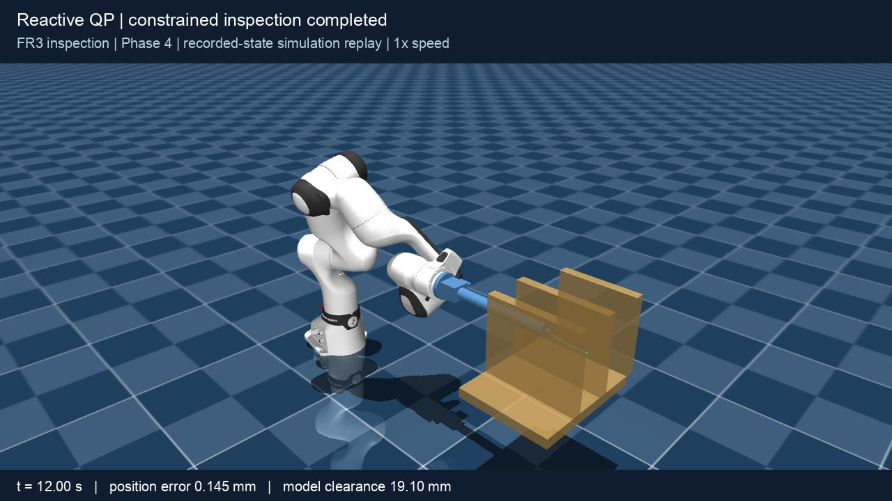

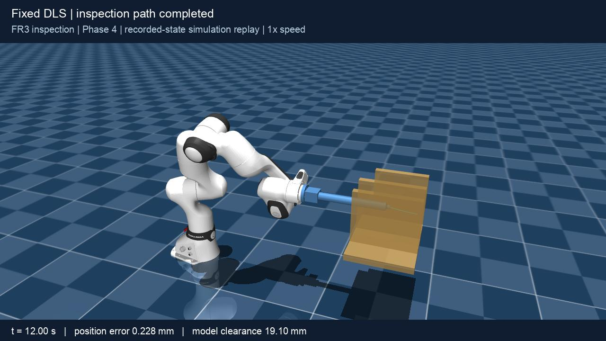

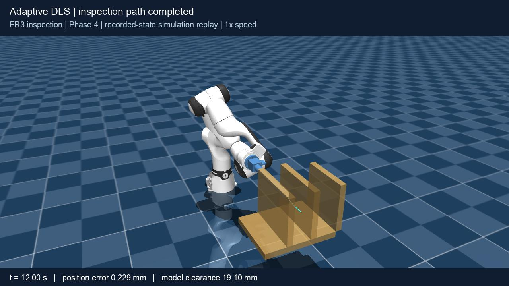

Selection: completed evaluation seed 81011 from each of these methods. Both DLS
methods had lower peak position error on 81011 than on 81012; the QP 81012 trial
failed. All failures remain retained, including Servo halts. These curated clips
do not imply superiority or replace the [full Phase 4 review](../reviews/phase_4_review.md).
Clearance overlays report the shared controller model rather than a physical
safety certificate. Replay uses the original frozen records, which precede the
separately verified online position-monitor repair.

Provenance and hashes:
[QP](../videos/phase4-reactive-qp-81011.json),
[fixed DLS](../videos/phase4-fixed-dls-81011.json),
[adaptive DLS](../videos/phase4-adaptive-dls-81011.json).
The [renderer](../scripts/render_task_video.py) samples nearest saved post-step
states and runs forward geometry only; it does not simulate new motion. Raw
recordings remain in the verified local Phase 4 evidence archive.

## Inspection assembly

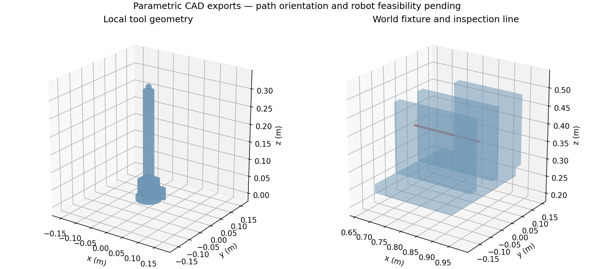

Parametric CAD tool and fixture, with persisted-document and export checks.

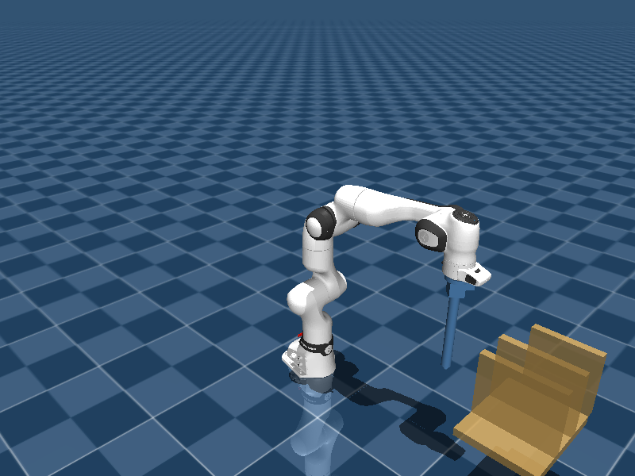

FR3 with the inspection tool and separate fixture collision components.
This image depicts the integrated scene; it is not a predictive-control result.

## Simulation and diagnostic figures

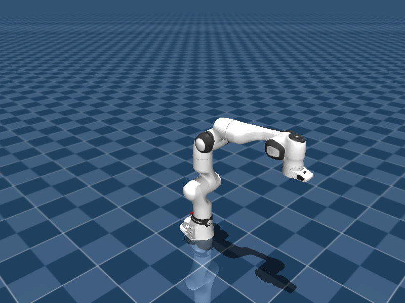

Pinned FR3 model running in MuJoCo, from the Phase 0 simulation check.

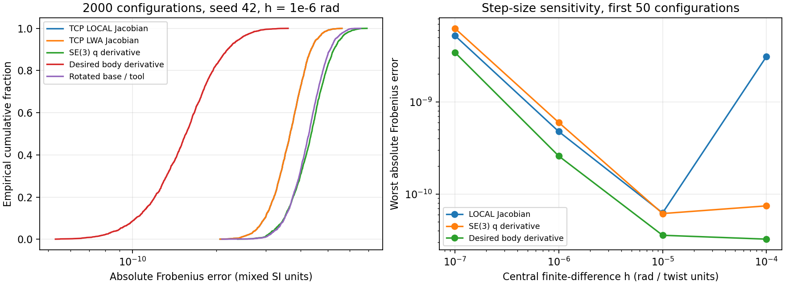

Kinematics validation figure; provenance is recorded in
[the figure manifest](../figures/kinematics_figure_manifest.json) and
[Phase 1 review](../reviews/phase_1_review.md).

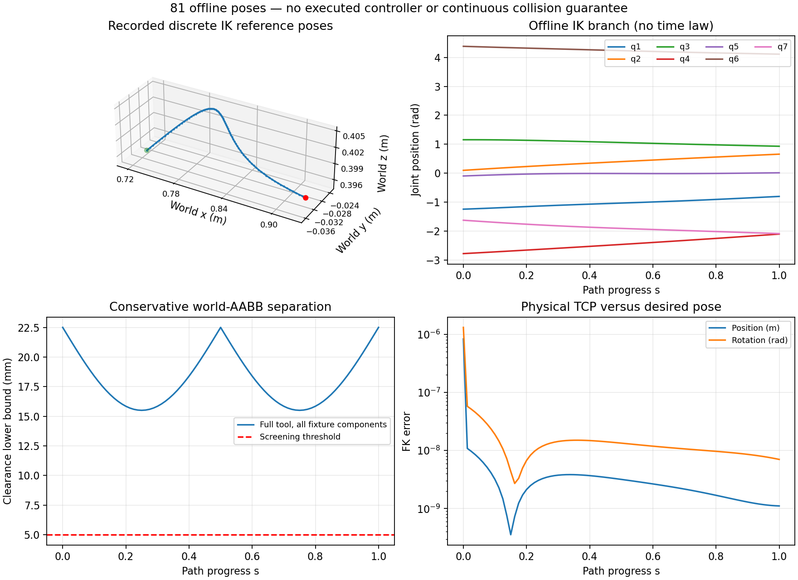

81 discrete candidate inspection poses with conservative full-tool clearance
screening. These are offline pose checks, not a continuous executed trajectory.
[Figure manifest](../figures/offline_inspection_figure_manifest.json).

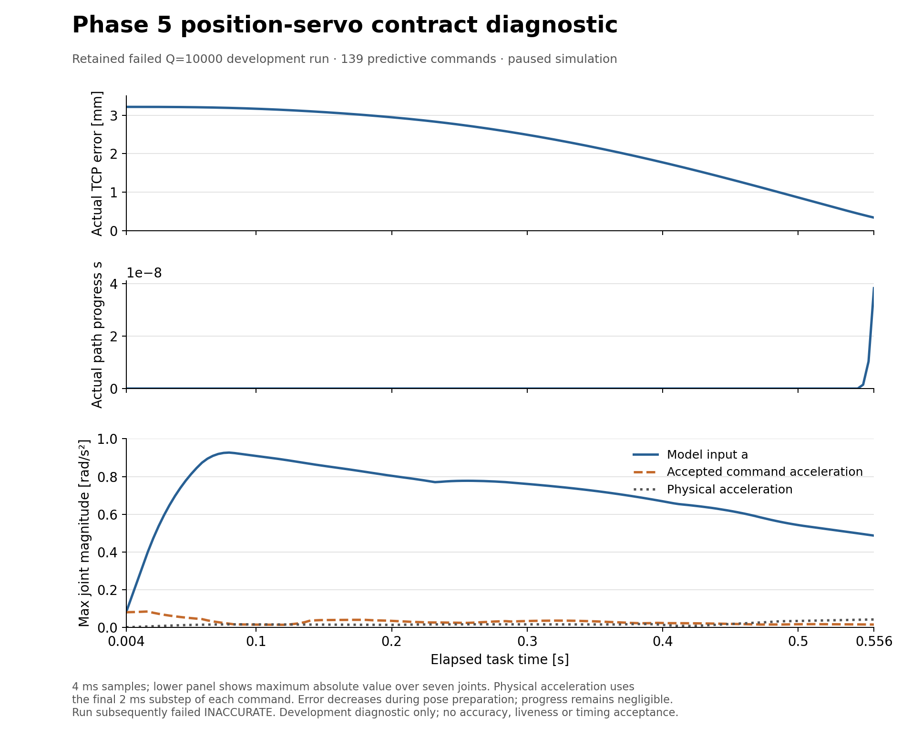

The retained failed high-tracking-weight development run corrects the initial
pose while path progress remains negligible. Model input, command acceleration
and measured physical acceleration have different meanings under the existing
position servo. This is a paused-simulation development diagnostic, not Phase 5
acceptance. [Independent mathematical audit](../reviews/evidence/predictive_math_specialist_20261007.md)
and [source/output hashes](../figures/phase5/phase5_servo_contract_v19.json).

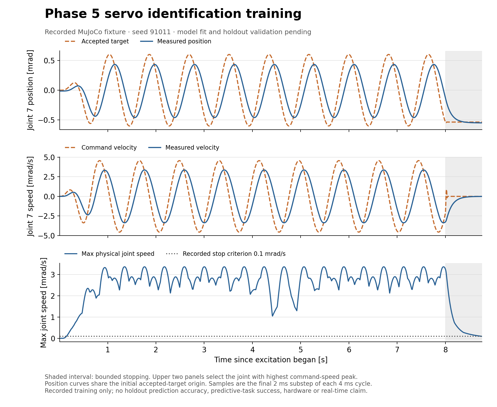

Actual MuJoCo training data shows position-servo lag and bounded stopping.
Root independently checks recorded state continuity, command integration and
derivatives, frozen URDF/protocol limits and recorded command age. The model
has not yet been fitted or validated on the separate development trace.
This is a calibration fixture, not predictive-task or online acceptance.
[Figure hashes](../figures/phase5/phase5_servo_training_v1.json).

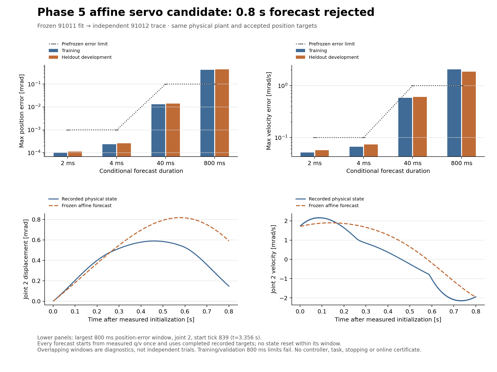

The frozen first affine model passes short-duration checks but exceeds its
prefrozen 800 ms limits on both training and separate development validation.
The independent root reproduces these errors without future-state resets.
Overlapping forecast windows are diagnostics, not independent trials.
[Independent audit](../reviews/evidence/servo_model_v1_math_audit_20261007.md)
and [figure provenance](../figures/phase5/phase5_servo_model_v1_failed.json).
[Separate soft-v2 stress on observed v19](../reviews/evidence/servo_soft_v2_v19_retrospective_20261007.md)
retains motion/stopping and domain violations. It is a retrospective diagnostic
and supplies no new validation credit.

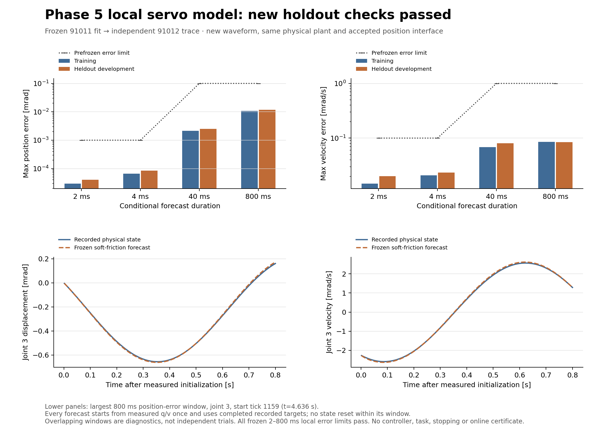

The frozen local soft-friction model passes the stated short and 800 ms checks
on a new development waveform. Root independently recomputes its scalar
transition, derivatives and all forecast windows. Earlier preparation motion
exceeds this model's declared domain; an expanded waveform is rejected by the
original command constraints. This is local recorded-input prediction evidence,
not main-controller or Phase5 acceptance.
[Independent local scope](../reviews/evidence/servo_soft_v2_math_audit_20261007.md)
and [figure hashes](../figures/phase5/phase5_servo_soft_friction_v2.json).
The separate [augmented transition oracle](../reviews/evidence/augmented_soft_servo_reference_20261007.md)
checks command/physical state propagation and horizon derivatives for the frozen
local model. Its numerical trajectories are model calculations; the plot above
continues to identify the actual recorded validation input.

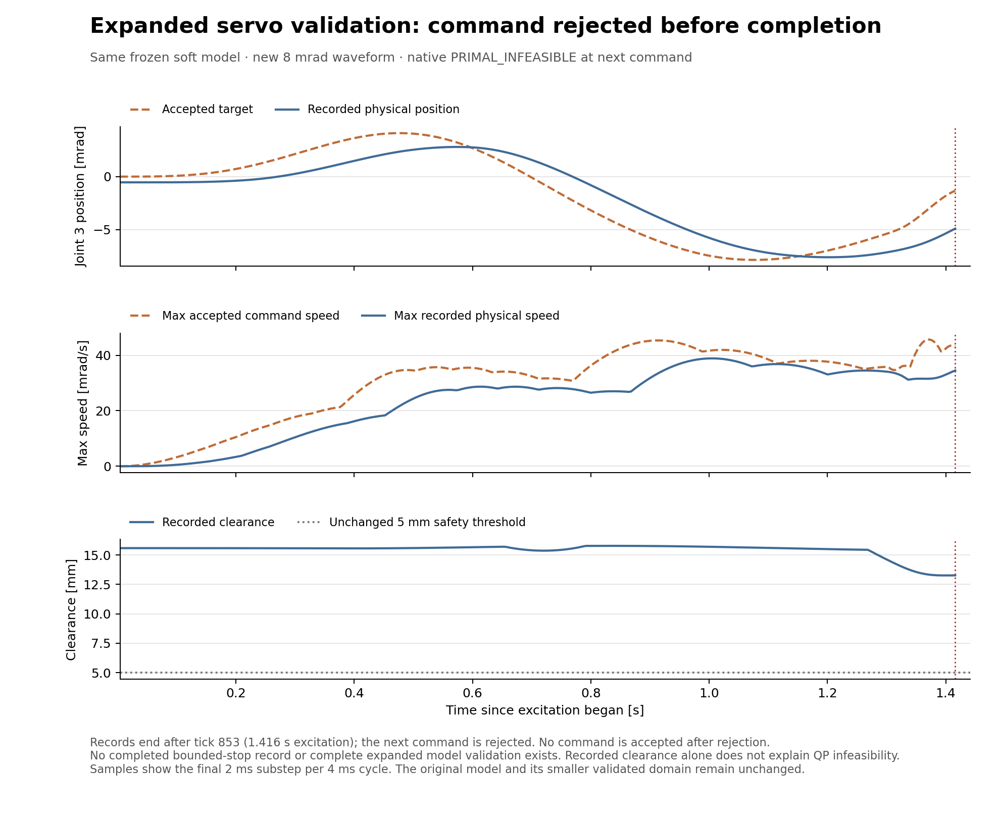

The larger waveform ends after 1.416 seconds of excitation when the command
QP is infeasible. The plot shows accepted targets, physical motion and recorded
clearance; it does not establish a feasible next command or a completed stop.
A subsequent full replay confirms the first shared-stop QP is also infeasible.
[Original failed trial](../reviews/phase_5_servo_expanded_validation_failure_20261007.md)
and [independent constraint proof](../reviews/evidence/servo_expanded_failure_stop_math_audit_20261007.md).

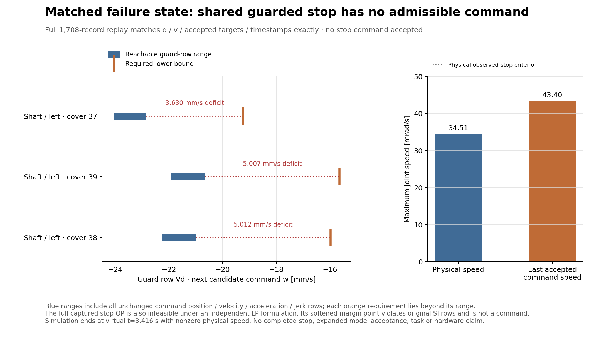

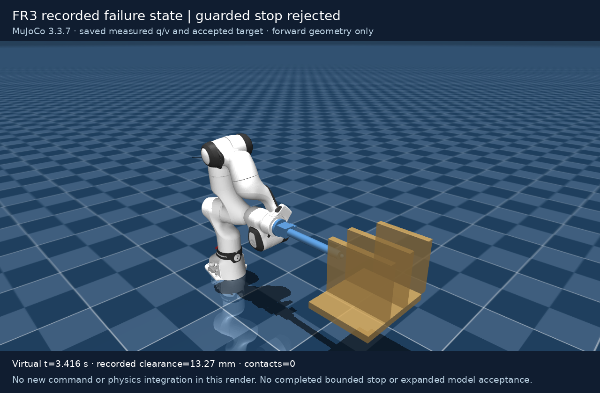

The next-command range excludes three required geometry bounds. The recorded
pose render uses forward geometry with saved state; it adds no new physical
trajectory. Both views identify a verified failure with no accepted stop command.
[Producer diagnostic](../reviews/phase_5_servo_failure_stop_diagnostic_20261007.md)
and [archive/closure identities](../reviews/evidence/servo_stop_diagnostic_checkpoint_20261007.json).

## Further Phase 5 development evidence

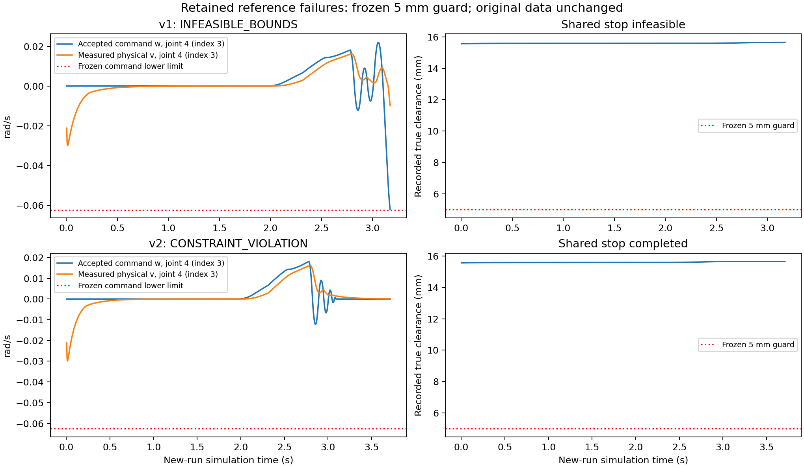

The first reference reaches a signed command-speed dead end and cannot stop;
the second primary run fails SI acceptance but completes its fresh shared stop.
The displayed guard is the frozen **5mm** bound. The original producer plot
mistakenly labels it10mm; its bytes remain in the original archive and historical
figure, while this separate correction leaves data and actual guards unchanged.
Joint4 means zero-based index3.
[Independent empty-box proof](../reviews/evidence/servo_safe_reference_v1_emptybox_20261007.md)
and [precision diagnosis](../reviews/evidence/servo_safe_reference_v2_precision_20261007.md).

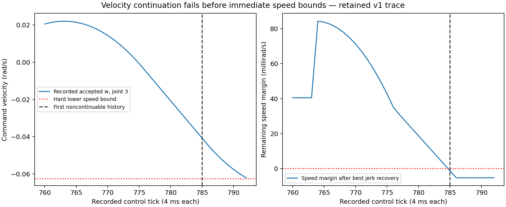

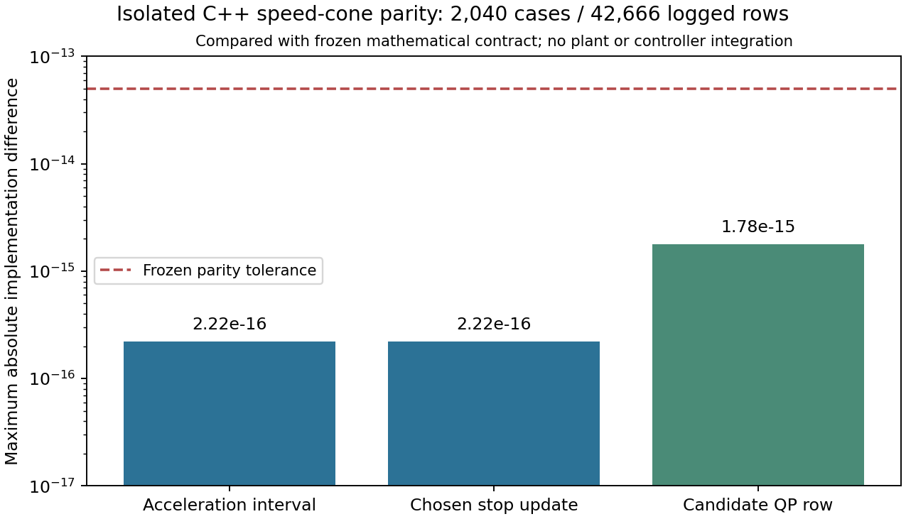

These mathematical views establish discrete signed speed continuation under
the stated acceleration/jerk limits. They do not establish position, collision
or physical stopping. “Joint3” in the original plot denotes index3, vendor joint4.
[Independent scope](../reviews/evidence/signed_command_cone_math_audit_20261007.md).

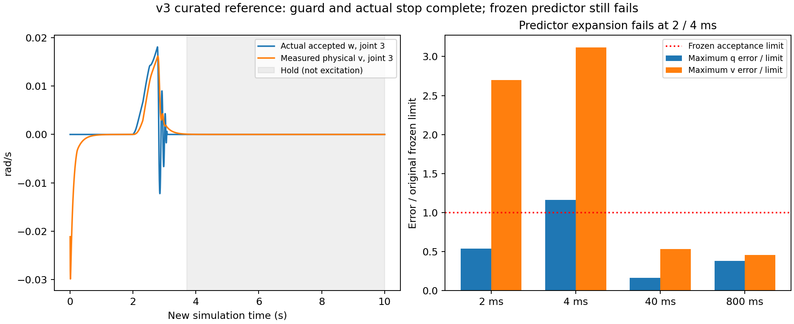

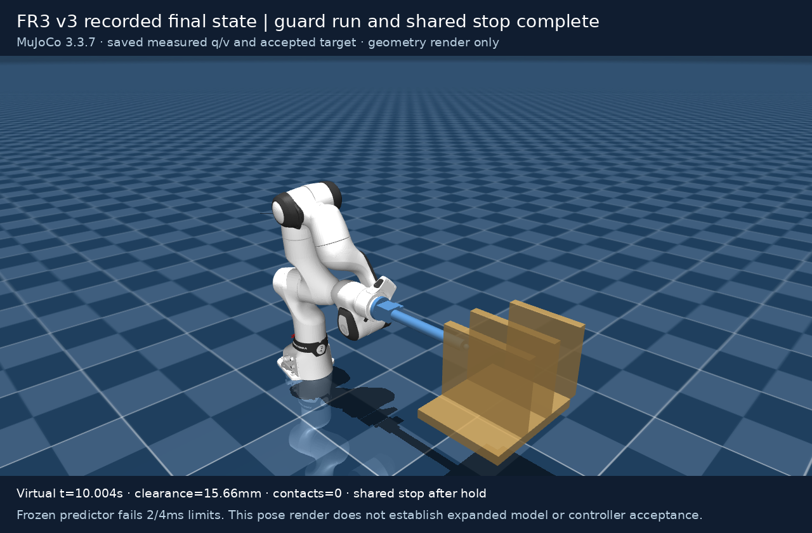

V3 passes the recorded guard and final hold-end stop, while its frozen predictor
fails the2/4ms limits. The shaded hold is not excitation; the final new stop is
not a moving-stop challenge. The render uses saved measured state and geometry.
The plot's joint3 label denotes index3, vendor joint4.
[Independent complete-window/QP/history audit](../reviews/evidence/servo_safe_reference_v3_root_audit_20261007.md).

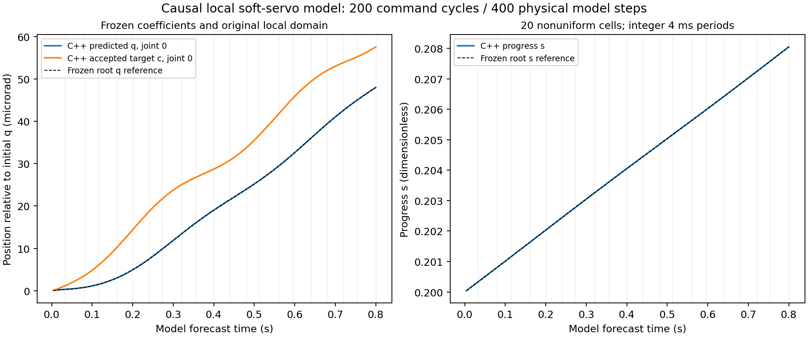

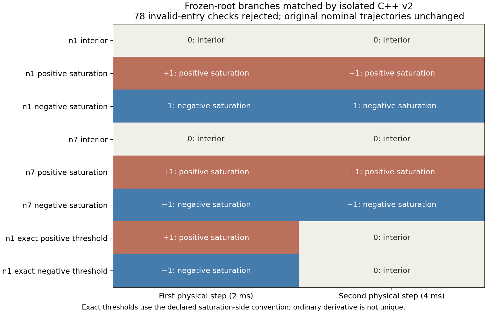

These are calculations of the frozen local model, with separate accepted target
and measured-state coordinates. They reproduce an independent transition oracle
and declared threshold branches; they are not physical trajectories or expanded
model validation. The original local domain and failed expanded accuracy gate
remain unchanged. [API and branch scope](../reviews/phase_5_causal_servo_api_v2_20261007.md).

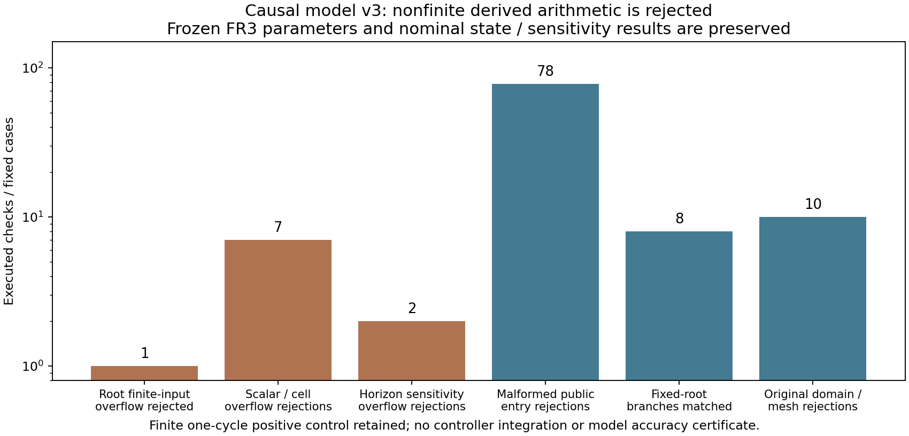

A separate v3 clone rejects overflow in transition and horizon sensitivity
arithmetic, while preserving frozen model/branch regressions. Counts overlap
across API entry points and are fixed tests, not independent research trials.
The earlier physical prediction failures remain.
[Arithmetic scope and retained counterexamples](../reviews/phase_5_causal_servo_finite_v3_20261007.md).

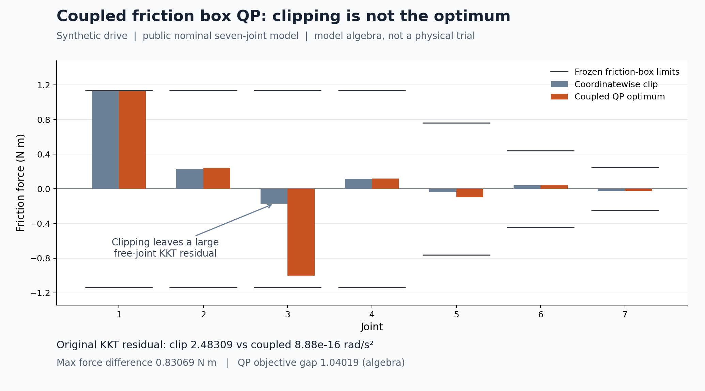

For this declared synthetic drive and public nominal matrix, coordinatewise
clipping leaves a free-joint KKT residual of2.48309rad/s². Exhaustive coupled
active-set solving satisfies the original box/KKT conditions to8.88e-16.
Root reruns the full oracle with exact JSON equality. The chart is public-model
algebra; its synthetic forces are not physical actuator commands or prediction
accuracy evidence. [Oracle, derivatives and threshold scope](../reviews/evidence/coupled_friction_box_root_oracle_20261007.md).

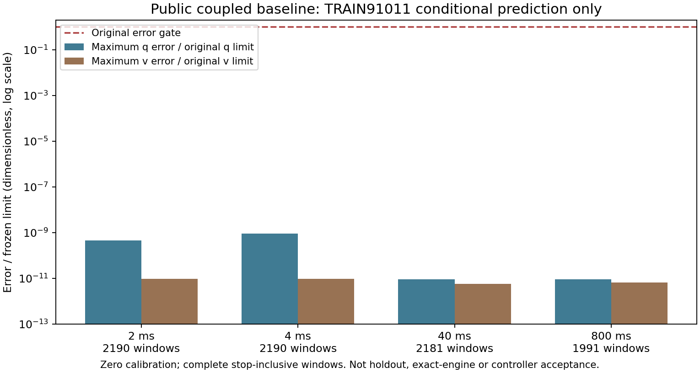

The uncalibrated public coupled model passes every complete active TRAIN91011
forecast window under the recorded accepted targets. Original limits and
stopping/crossing windows are retained. Root independently recomputes19 fixed
windows and verifies the full window roster; most reported errors are near
roundoff. This is training-side prediction evidence, with all frozen damping
ratios equal1. Fresh validation, transition derivatives and main-controller
integration remain pending.
[Independent mathematics and causal scope](../reviews/evidence/public_coupled_training_v1_math_audit_20261007.md)
and [subsequent asset preservation verification](../reviews/evidence/public_coupled_training_v1_post_closure_20261007.json).

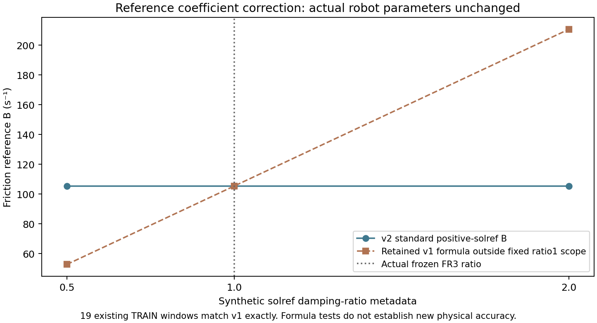

V2 uses the standard positive-solref friction coefficient and rejects unsupported
parameters. Changed ratios are synthetic metadata tests; actual robot parameters
stay unchanged. The19 existing TRAIN windows match v1 exactly. This does not add
physical prediction accuracy or unseen validation evidence.
[Independent contract checks](../reviews/evidence/public_coupled_v2_reference_root_review_20261007.md).

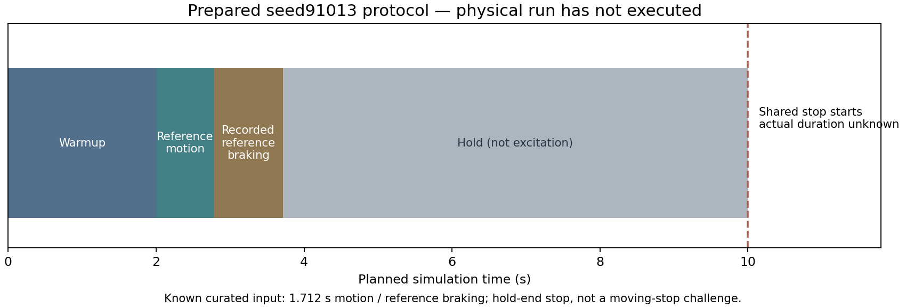

This is a planned timeline, with an unknown final stop duration. Root rejected
this first protocol's scorer after synthetic false-PASS counterexamples; no
new physical run has occurred. The diagram supplies no measured motion or
performance result. [Rejection and required revision](../reviews/evidence/public_validation_91013_protocol_v1_root_review_20261007.md).

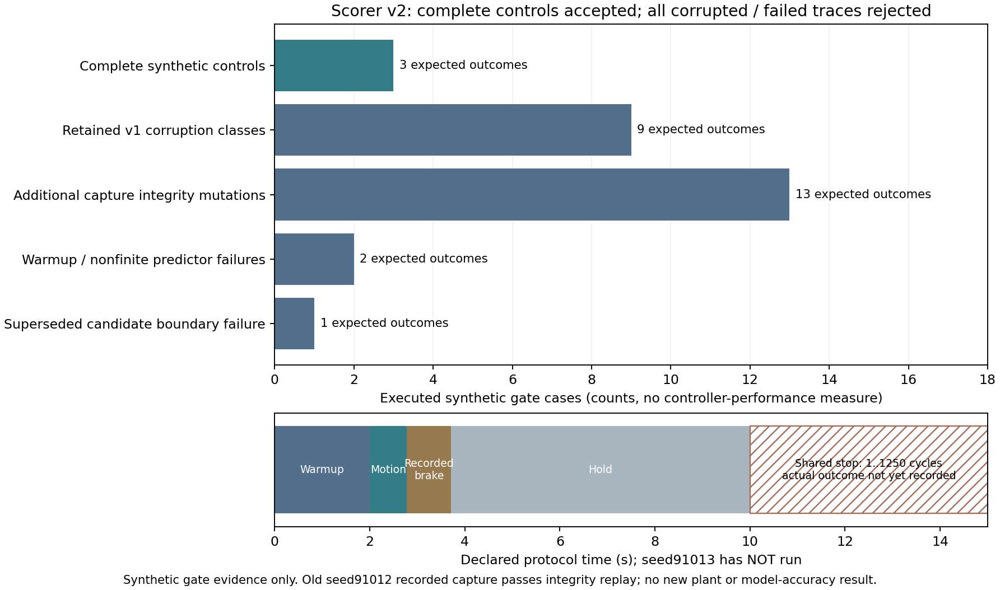

Three complete synthetic controls pass and25 corrupted/failing controls are rejected.
Root's separate eight capture-only checks have their expected outcomes. These are
scorer checks, not new robot or model accuracy results. The timeline is declared,
with1..1250 possible stop cycles. This image preserves the pre-run protocol; the
approved actual run is shown below.
[Independent replacement review](../reviews/evidence/public_validation_91013_protocol_v2_root_review_20261007.md).

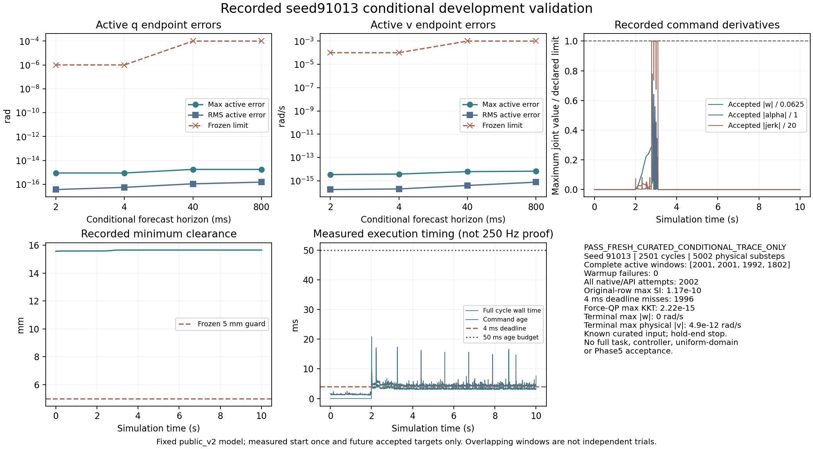

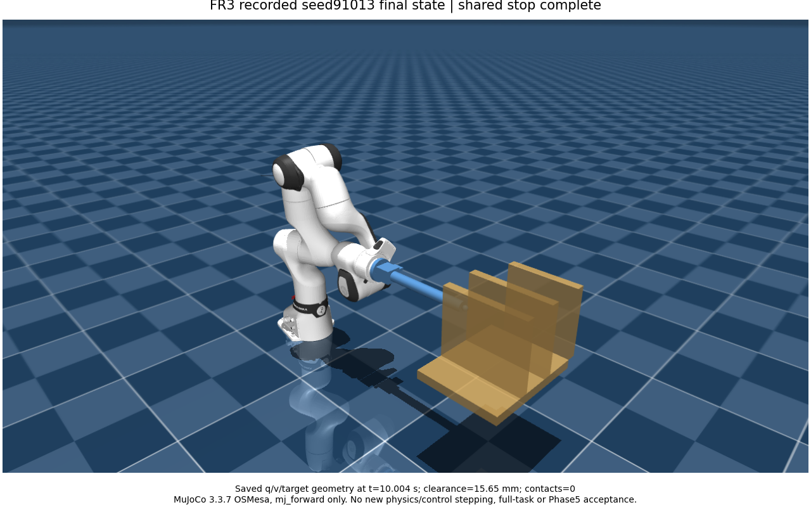

The frozen conditional predictor passes all9796 complete windows on this known
curated development input. Root independently checks the full capture and21
predeclared forecasts. The actual final state is rendered at10.004s; it follows
a long hold, not a moving-stop challenge or complete inspection task. All1996
4ms deadline misses remain visible. Geometry is metres and joint angles radians;
provenance includes actual raw/model/renderer/asset hashes. No Phase5 or250Hz
acceptance follows. [Independent executed review](../reviews/evidence/public_coupled_validation_91013_root_review_20261007.md).

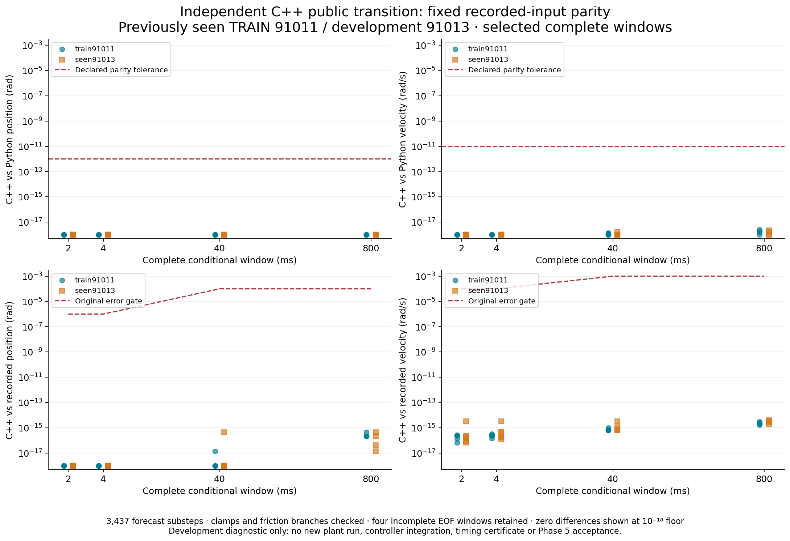

Forty complete selected TRAIN91011/development91013 windows match the frozen
Python model; four EOF windows remain incomplete. Root separately checks10
state and14 QP cases. This is seen-input engineering parity, without a new
plant run, derivative, main-controller or timing certificate. A generic tiny
friction-bound false rejection is retained; the fixed FR3 bounds avoid it.
[Independent C++ review](../reviews/evidence/public_coupled_cpp_v1_root_review_20261007.md).

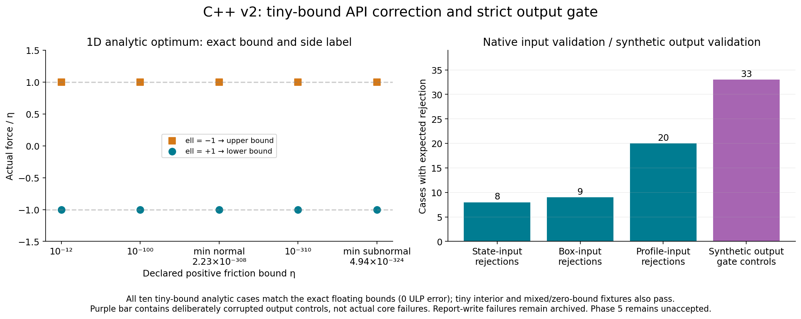

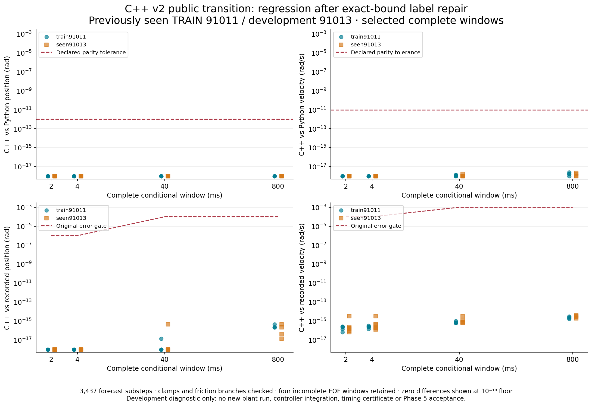

All ten tiny-bound scalar cases through the minimum subnormal return exact
floating bounds and correct side labels. Purple bars are disclosed synthetic
output corruptions. Forty complete seen-input windows retain numerical parity;
four EOF windows remain incomplete. Root separately checks10 native states,
16 QPs and11 schema controls. This corrects the v2 API/gate only; derivative,
main-controller, timing and Phase5 acceptance remain pending.
[Independent v2 review](../reviews/evidence/public_coupled_cpp_v2_root_review_20261007.md).

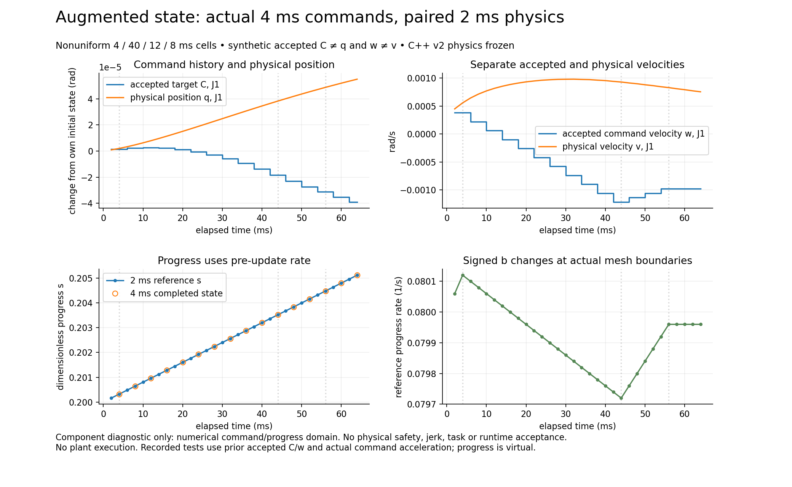

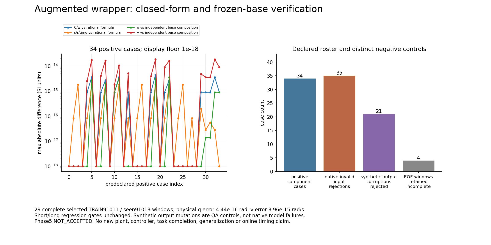

The separate wrapper preserves4ms accepted command updates and paired2ms
physical propagation over nonuniform cells. Figures show executed native-model
telemetry and known-input regression scope; progress is virtual. Root separately
checks6 positive/21 negative cases, rational command/progress references, exact
held-input subdivision and retained future-failure prefixes. These are component
checks, with main-controller, derivatives, task and timing acceptance pending.
[Independent augmented review](../reviews/evidence/public_coupled_augmented_root_review_20261007.md).

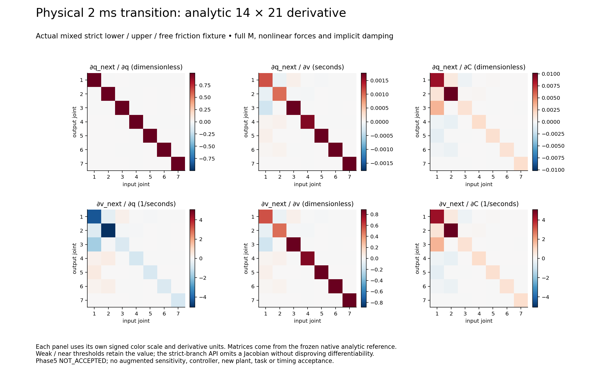

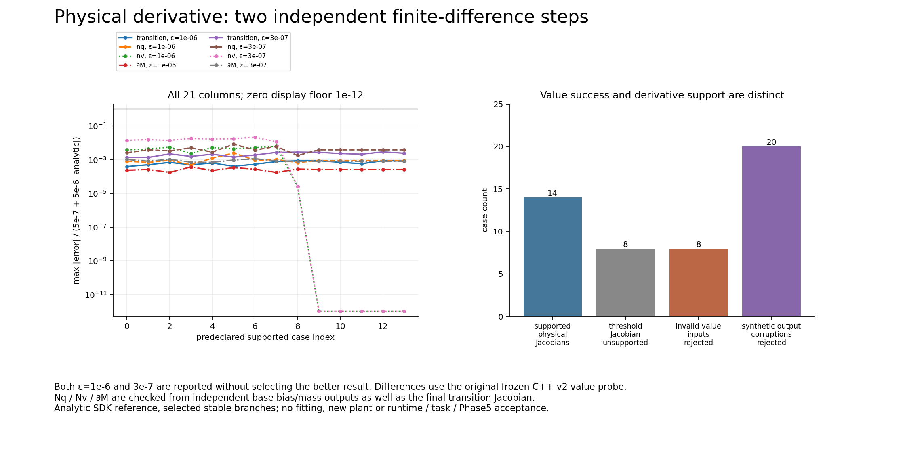

Each Jacobian block has explicit units. Both fixed FD steps check every21 input
column plus full bias/mass partials on selected strict branches. Root separately
checks6 supported,3 uncertified and2 invalid cases, including nonzero-motion
bias. Threshold outputs omit a matrix conservatively; this does not prove
nondifferentiability of the composite map. These are local analytic component
checks, with augmented/horizon, controller, task and timing gates pending.
[Independent physical derivative review](../reviews/evidence/public_physical_derivative_root_review_20261007.md).

## Downloadable 3D models

| Asset | Format / units | Purpose |
|---|---|---|
| [Inspection assembly](../cad/generated/inspection.FCStd) | FreeCAD document | Editable parametric source; opening requirements in the CAD guide |
| [Tool solid](../cad/generated/tool.step) | STEP / millimetres | CAD exchange |
| [Fixture solid](../cad/generated/fixture.step) | STEP / millimetres | CAD exchange |
| [Tool visual mesh](../cad/generated/tool_visual.stl) | STL / metres | Visualization |
| [Fixture visual mesh](../cad/generated/fixture_visual.stl) | STL / metres | Visualization |
| [Tool collision mesh](../cad/generated/tool_collision.stl) | STL / metres | Simplified collision representation |
| [Fixture collision mesh](../cad/generated/fixture_collision.stl) | STL / metres | Simplified collision representation |

STL does not encode a unit convention: use the units listed above when importing.
The fixture channel must remain open; a single convex hull of the entire fixture
would fill it. These are research simulation models, with an experimental flange
interface rather than a certified manufacturing design.

See [CAD source parameters](../cad/source/inspection.json),
[artifact hashes](../cad/generated/cad_evidence.json),
[CAD guide](../cad/README.md) and
[independent CAD review](../reviews/cad_component_review.md).

## Subsequent milestones

Add inspected simulation renders, executed trajectory and constraint plots,
and updated useful models as work is completed. Each addition must identify
its data or parameter source and whether it is a development diagnostic or an
accepted result. Commit and push these assets with the milestone backup.

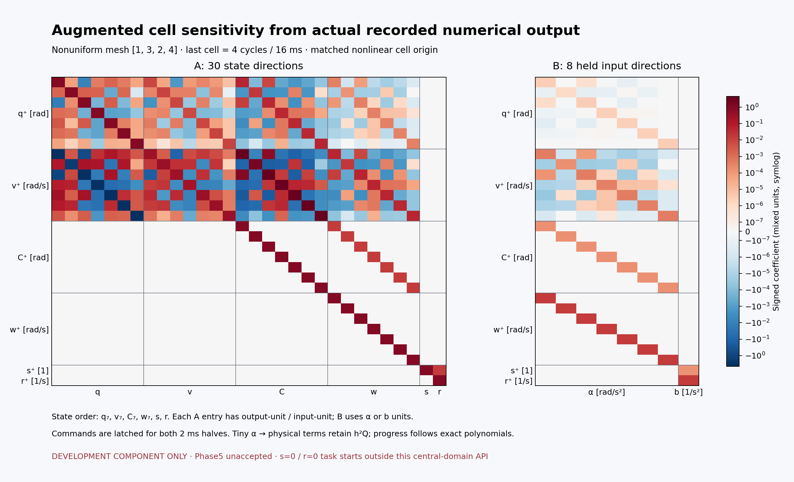

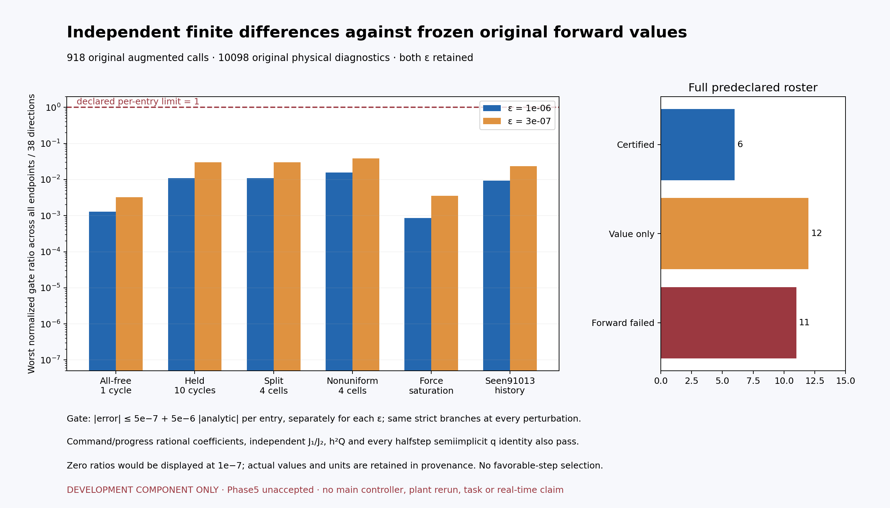

These numerical-output plots show the final16ms cell of a nonuniform mesh and
the full producer6/12/11case roster. Matrix blocks have output/input SI units;
FD gate ratios are dimensionless. Root separately verifies all62 initial and
distinct cell-input directions at both epsilons. All2611 dependencies and both
host copies of the complete evidence are verified; failed workflow publications
are retained. The current interior API does not certify actual s=0/r=0 starts.
Boundary support, horizon cost/main integration, task and timing gates remain
pending; Phase5 is unaccepted.
[Independent augmented sensitivity review](../reviews/evidence/public_augmented_sensitivity_root_review_20261007.md).

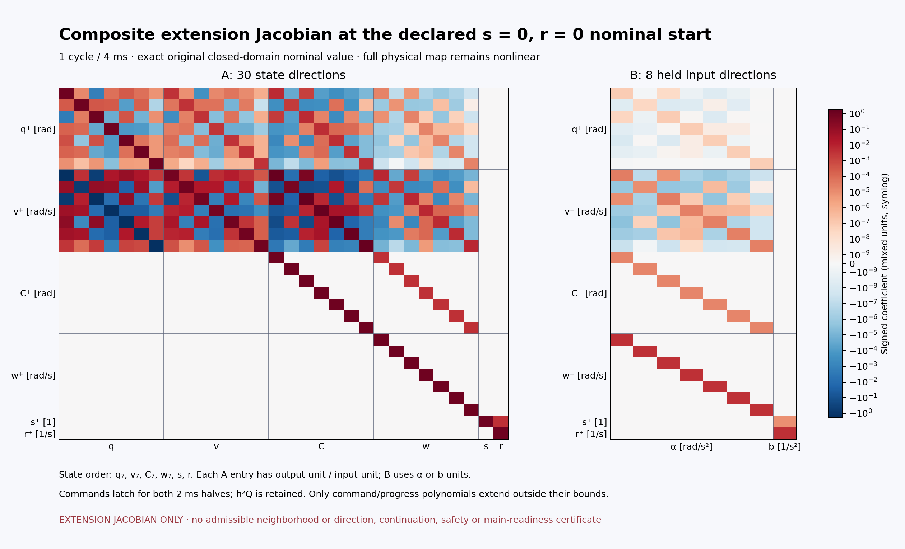

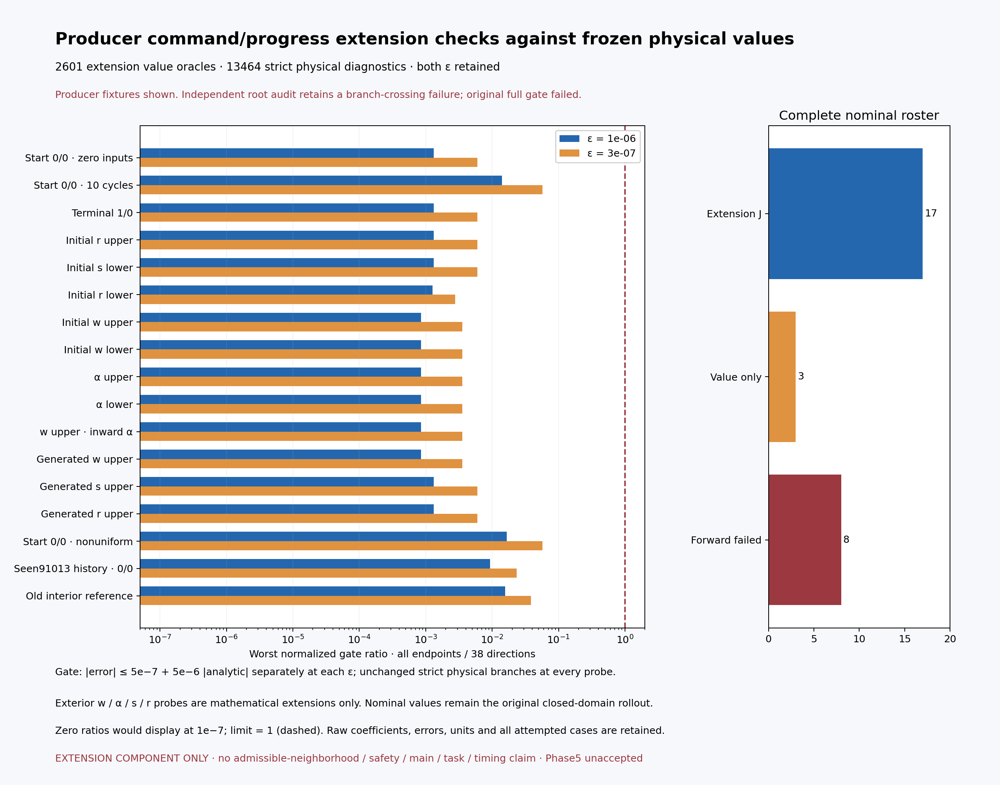

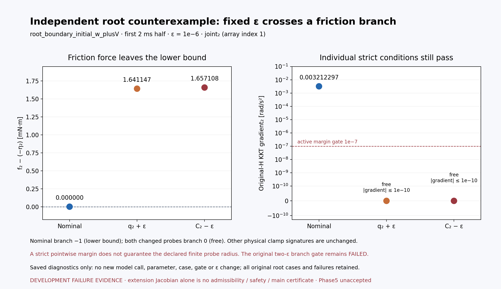

These actual numerical-output figures distinguish producer17fixture passes
from the independent fixed6case review:5pass both fixed steps,1retains a
friction-branch/derivative-entry failure. Nominal0/0startup and nonuniform
initial/distinct-input derivatives pass their stated component checks. The
original smaller-step result does not replace the failedtwo-step gate.
Matrix blocks have mixed output/input SI units; counterexample force distance
is mN*m and gradient rad/s². All2682 dependencies,3676 producer payloads
and452 root payloads are verified on Mac/Dell. These extension derivatives
provide no finite perturbation radius, actual command admission, continuation
or main/task/timing certificate. Phase5 remains unaccepted.
[Independent extension review and retained failure](../reviews/evidence/public_augmented_extension_root_review_20261008.md).

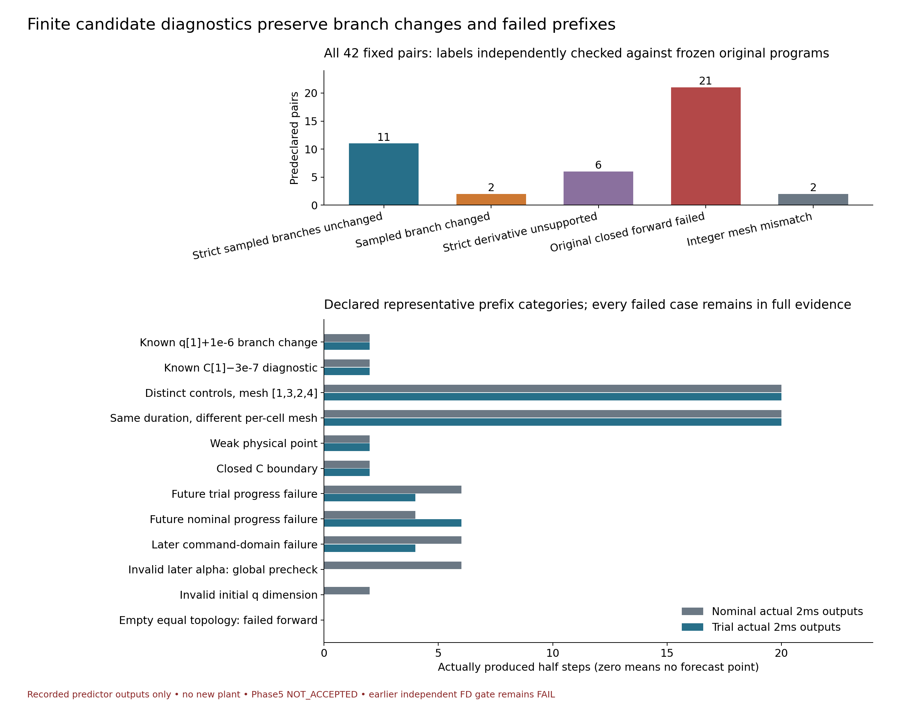

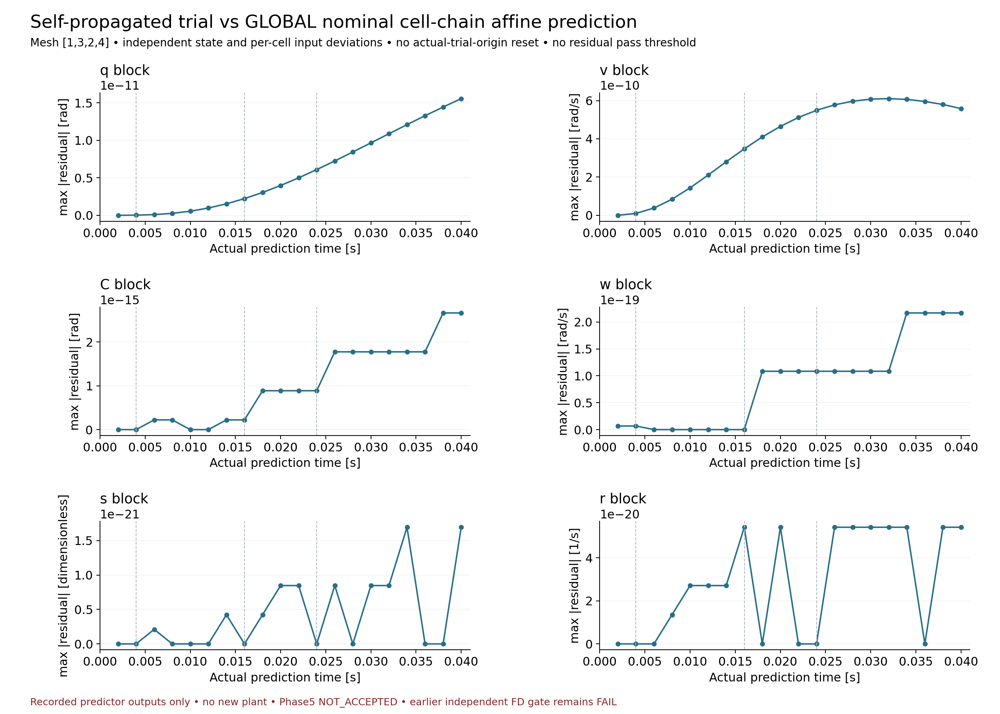

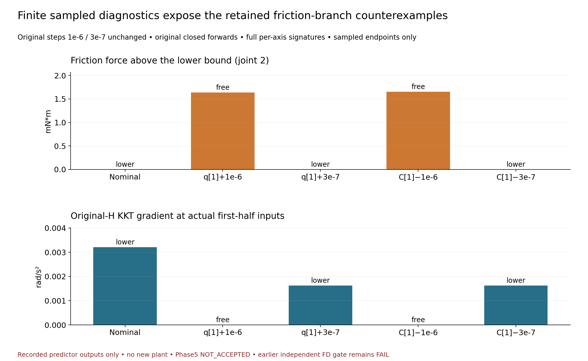

These actual predictor-output plots retain all42 outcomes and disclose the
selected illustrative prefixes. Residual blocks use their individual SI units
and have no quality acceptance threshold. The shown producer nonuniform case
has unchanged sampled branches; the independent root's different prospective
finite case changes branches, with q/v residuals0.000173rad/0.005716rad/s.
Neither plot establishes a connecting segment, perturbation ball, execution,
safety or controller readiness. The original extension FD gate remains failed.
No new plant/task video is available; Phase5 remains unaccepted.
[Independent finite-trial review](../reviews/evidence/public_finite_trial_root_review_20261008.md).

The next adapter's [source integration contract](../reviews/evidence/public_affine_horizon_integration_contract_20261008.md)
connects these existing sampled diagnostics to a planned general-affine horizon
algebra layer. It is a reviewed design, with no new rendered trajectory or
numerical result; the actual diagnostic figures above retain their stated scope.

The [reviewed source interface](../tools/phase5_public_affine_horizon_cpp/INTERFACE_SCHEMA.md)
and independent oracle definitions are preserved without evaluation. There is
no new simulated motion, matrix result or cost figure for this source-only
checkpoint. Its fixed small diagnostic envelope is separate from the pending
full project horizon and Phase5 task/timing results.

The [source implementation checkpoint](../reviews/evidence/public_affine_horizon_source_implementation_review_20261008.json)
preserves the separate algebra kernel and its review before any build or new
numerical output. Actual matrix/cost figures will follow frozen numerical
verification; existing physical renders and diagnostic plots retain their scope.

## Saved pause — 2026-10-08

Checkpoint 365bcf6 preserves the pause after the affine-horizon build/empty-preflight checkpoint. The human resumed the project on 2026-10-08; versioned verification preparation is now in progress. No nonempty numerical run or complete task motion was produced in this unit, so no new motion clip or performance figure is claimed. Existing accepted Phase4 visuals and prior diagnostic figures remain preserved. [Saved checkpoint](../reviews/evidence/public_affine_horizon_build_freeze_checkpoint_20261008.json); [pause status](../PROJECT_PAUSED.json).
