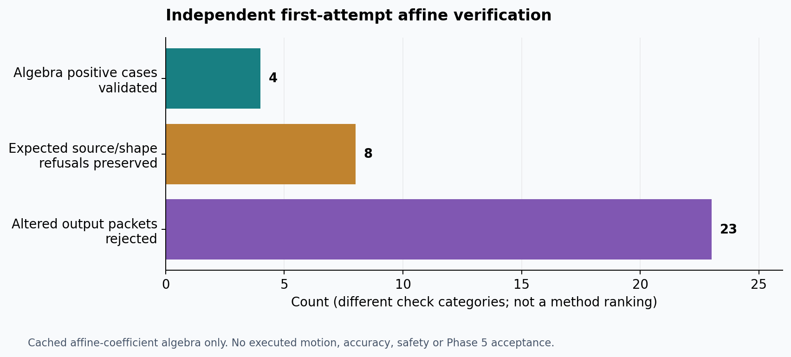
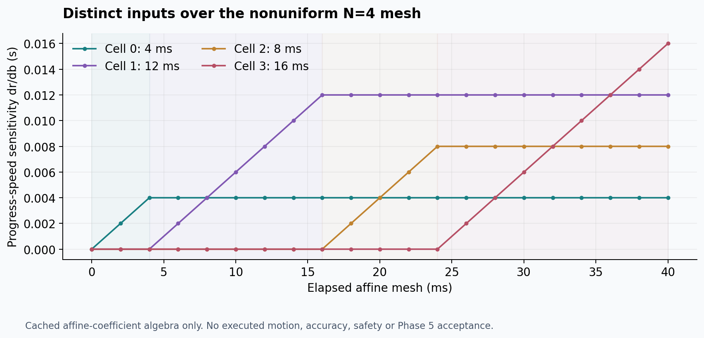
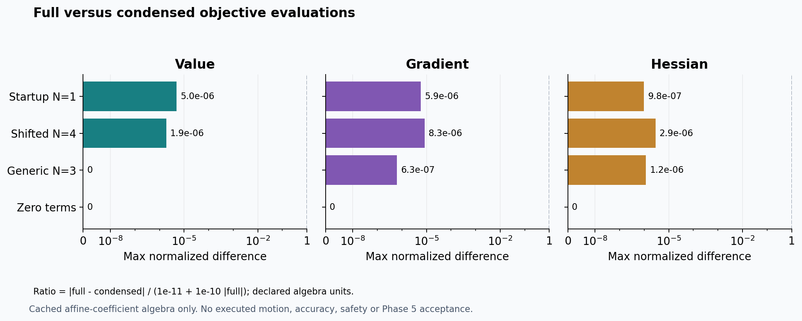
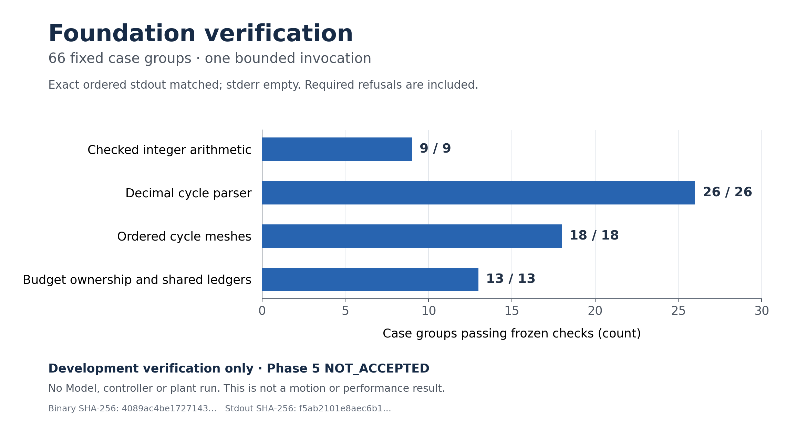
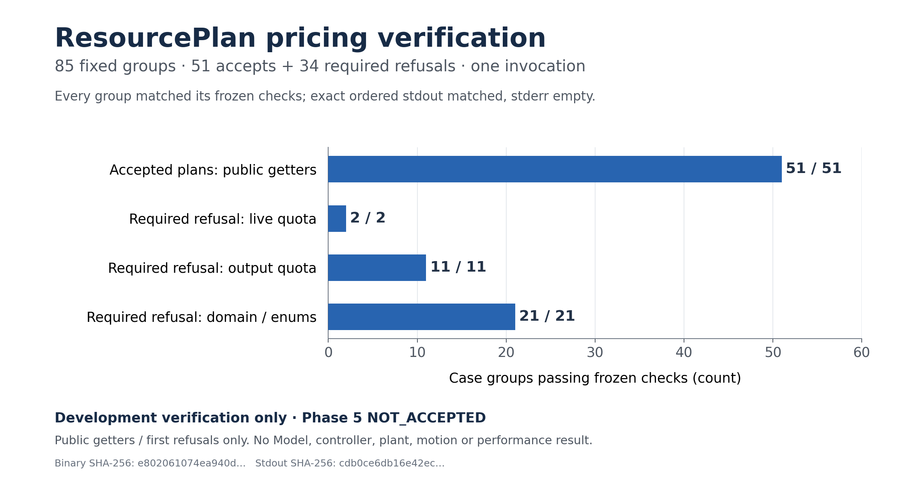

# Project showcase

Actual project renders, diagnostic figures and downloadable CAD artifacts.
Phase 0–4 component gates have passed; Phase 5 awaits independent acceptance.
These assets illustrate the stated scope and do not establish final research
performance or physical hardware safety.

## Task-completion videos

Three curated successful Phase 4 inspection trials, rendered from saved measured
joint states using MuJoCo 3.3.7 and the pinned scene assets. Each clip is 24 seconds
at 720p/30 fps and 1x simulated-time speed. It includes warmup, path following and
settling; the mint curve is the reference-path overlay. These are recorded-state
replays, not fresh experiments or wall-clock real-time demonstrations.

| Method | Video | Recorded final position error |
|---|---|---:|
| Reactive QP | [Watch / download](../videos/phase4-reactive-qp-81011.mp4) | 0.00471 mm |
| Fixed DLS with common constraint projection | [Watch / download](../videos/phase4-fixed-dls-81011.mp4) | 0.00514 mm |
| Adaptive DLS with common constraint projection | [Watch / download](../videos/phase4-adaptive-dls-81011.mp4) | 0.00514 mm |

Selection: completed evaluation seed 81011 from each of these methods. Both DLS
methods had lower peak position error on 81011 than on 81012; the QP 81012 trial
failed. All failures remain retained, including Servo halts. These curated clips
do not imply superiority or replace the [full Phase 4 review](../reviews/phase_4_review.md).
Clearance overlays report the shared controller model rather than a physical
safety certificate. Replay uses the original frozen records, which precede the
separately verified online position-monitor repair.

Provenance and hashes:
[QP](../videos/phase4-reactive-qp-81011.json),
[fixed DLS](../videos/phase4-fixed-dls-81011.json),
[adaptive DLS](../videos/phase4-adaptive-dls-81011.json).
The [renderer](../scripts/render_task_video.py) samples nearest saved post-step
states and runs forward geometry only; it does not simulate new motion. Raw
recordings remain in the verified local Phase 4 evidence archive.

## Inspection assembly

Parametric CAD tool and fixture, with persisted-document and export checks.

FR3 with the inspection tool and separate fixture collision components.
This image depicts the integrated scene; it is not a predictive-control result.

## Simulation and diagnostic figures

Pinned FR3 model running in MuJoCo, from the Phase 0 simulation check.

Kinematics validation figure; provenance is recorded in
[the figure manifest](../figures/kinematics_figure_manifest.json) and
[Phase 1 review](../reviews/phase_1_review.md).

81 discrete candidate inspection poses with conservative full-tool clearance
screening. These are offline pose checks, not a continuous executed trajectory.
[Figure manifest](../figures/offline_inspection_figure_manifest.json).

The retained failed high-tracking-weight development run corrects the initial
pose while path progress remains negligible. Model input, command acceleration
and measured physical acceleration have different meanings under the existing
position servo. This is a paused-simulation development diagnostic, not Phase 5
acceptance. [Independent mathematical audit](../reviews/evidence/predictive_math_specialist_20261007.md)
and [source/output hashes](../figures/phase5/phase5_servo_contract_v19.json).

Actual MuJoCo training data shows position-servo lag and bounded stopping.
Root independently checks recorded state continuity, command integration and
derivatives, frozen URDF/protocol limits and recorded command age. The model
has not yet been fitted or validated on the separate development trace.
This is a calibration fixture, not predictive-task or online acceptance.
[Figure hashes](../figures/phase5/phase5_servo_training_v1.json).

The frozen first affine model passes short-duration checks but exceeds its
prefrozen 800 ms limits on both training and separate development validation.
The independent root reproduces these errors without future-state resets.
Overlapping forecast windows are diagnostics, not independent trials.
[Independent audit](../reviews/evidence/servo_model_v1_math_audit_20261007.md)
and [figure provenance](../figures/phase5/phase5_servo_model_v1_failed.json).
[Separate soft-v2 stress on observed v19](../reviews/evidence/servo_soft_v2_v19_retrospective_20261007.md)
retains motion/stopping and domain violations. It is a retrospective diagnostic
and supplies no new validation credit.

The frozen local soft-friction model passes the stated short and 800 ms checks
on a new development waveform. Root independently recomputes its scalar
transition, derivatives and all forecast windows. Earlier preparation motion
exceeds this model's declared domain; an expanded waveform is rejected by the
original command constraints. This is local recorded-input prediction evidence,
not main-controller or Phase5 acceptance.
[Independent local scope](../reviews/evidence/servo_soft_v2_math_audit_20261007.md)
and [figure hashes](../figures/phase5/phase5_servo_soft_friction_v2.json).
The separate [augmented transition oracle](../reviews/evidence/augmented_soft_servo_reference_20261007.md)
checks command/physical state propagation and horizon derivatives for the frozen
local model. Its numerical trajectories are model calculations; the plot above
continues to identify the actual recorded validation input.

The larger waveform ends after 1.416 seconds of excitation when the command
QP is infeasible. The plot shows accepted targets, physical motion and recorded
clearance; it does not establish a feasible next command or a completed stop.
A subsequent full replay confirms the first shared-stop QP is also infeasible.
[Original failed trial](../reviews/phase_5_servo_expanded_validation_failure_20261007.md)
and [independent constraint proof](../reviews/evidence/servo_expanded_failure_stop_math_audit_20261007.md).

The next-command range excludes three required geometry bounds. The recorded
pose render uses forward geometry with saved state; it adds no new physical
trajectory. Both views identify a verified failure with no accepted stop command.
[Producer diagnostic](../reviews/phase_5_servo_failure_stop_diagnostic_20261007.md)
and [archive/closure identities](../reviews/evidence/servo_stop_diagnostic_checkpoint_20261007.json).

## Further Phase 5 development evidence

The first reference reaches a signed command-speed dead end and cannot stop;
the second primary run fails SI acceptance but completes its fresh shared stop.
The displayed guard is the frozen **5mm** bound. The original producer plot
mistakenly labels it10mm; its bytes remain in the original archive and historical
figure, while this separate correction leaves data and actual guards unchanged.
Joint4 means zero-based index3.
[Independent empty-box proof](../reviews/evidence/servo_safe_reference_v1_emptybox_20261007.md)
and [precision diagnosis](../reviews/evidence/servo_safe_reference_v2_precision_20261007.md).

These mathematical views establish discrete signed speed continuation under
the stated acceleration/jerk limits. They do not establish position, collision
or physical stopping. “Joint3” in the original plot denotes index3, vendor joint4.
[Independent scope](../reviews/evidence/signed_command_cone_math_audit_20261007.md).

V3 passes the recorded guard and final hold-end stop, while its frozen predictor
fails the2/4ms limits. The shaded hold is not excitation; the final new stop is
not a moving-stop challenge. The render uses saved measured state and geometry.
The plot's joint3 label denotes index3, vendor joint4.
[Independent complete-window/QP/history audit](../reviews/evidence/servo_safe_reference_v3_root_audit_20261007.md).

These are calculations of the frozen local model, with separate accepted target
and measured-state coordinates. They reproduce an independent transition oracle
and declared threshold branches; they are not physical trajectories or expanded
model validation. The original local domain and failed expanded accuracy gate
remain unchanged. [API and branch scope](../reviews/phase_5_causal_servo_api_v2_20261007.md).

A separate v3 clone rejects overflow in transition and horizon sensitivity
arithmetic, while preserving frozen model/branch regressions. Counts overlap
across API entry points and are fixed tests, not independent research trials.
The earlier physical prediction failures remain.
[Arithmetic scope and retained counterexamples](../reviews/phase_5_causal_servo_finite_v3_20261007.md).

For this declared synthetic drive and public nominal matrix, coordinatewise
clipping leaves a free-joint KKT residual of2.48309rad/s². Exhaustive coupled
active-set solving satisfies the original box/KKT conditions to8.88e-16.
Root reruns the full oracle with exact JSON equality. The chart is public-model
algebra; its synthetic forces are not physical actuator commands or prediction
accuracy evidence. [Oracle, derivatives and threshold scope](../reviews/evidence/coupled_friction_box_root_oracle_20261007.md).

The uncalibrated public coupled model passes every complete active TRAIN91011
forecast window under the recorded accepted targets. Original limits and
stopping/crossing windows are retained. Root independently recomputes19 fixed
windows and verifies the full window roster; most reported errors are near
roundoff. This is training-side prediction evidence, with all frozen damping
ratios equal1. Fresh validation, transition derivatives and main-controller
integration remain pending.
[Independent mathematics and causal scope](../reviews/evidence/public_coupled_training_v1_math_audit_20261007.md)
and [subsequent asset preservation verification](../reviews/evidence/public_coupled_training_v1_post_closure_20261007.json).

V2 uses the standard positive-solref friction coefficient and rejects unsupported
parameters. Changed ratios are synthetic metadata tests; actual robot parameters
stay unchanged. The19 existing TRAIN windows match v1 exactly. This does not add
physical prediction accuracy or unseen validation evidence.
[Independent contract checks](../reviews/evidence/public_coupled_v2_reference_root_review_20261007.md).

This is a planned timeline, with an unknown final stop duration. Root rejected
this first protocol's scorer after synthetic false-PASS counterexamples; no
new physical run has occurred. The diagram supplies no measured motion or
performance result. [Rejection and required revision](../reviews/evidence/public_validation_91013_protocol_v1_root_review_20261007.md).

Three complete synthetic controls pass and25 corrupted/failing controls are rejected.
Root's separate eight capture-only checks have their expected outcomes. These are
scorer checks, not new robot or model accuracy results. The timeline is declared,
with1..1250 possible stop cycles. This image preserves the pre-run protocol; the
approved actual run is shown below.
[Independent replacement review](../reviews/evidence/public_validation_91013_protocol_v2_root_review_20261007.md).

The frozen conditional predictor passes all9796 complete windows on this known
curated development input. Root independently checks the full capture and21
predeclared forecasts. The actual final state is rendered at10.004s; it follows
a long hold, not a moving-stop challenge or complete inspection task. All1996
4ms deadline misses remain visible. Geometry is metres and joint angles radians;
provenance includes actual raw/model/renderer/asset hashes. No Phase5 or250Hz
acceptance follows. [Independent executed review](../reviews/evidence/public_coupled_validation_91013_root_review_20261007.md).

Forty complete selected TRAIN91011/development91013 windows match the frozen
Python model; four EOF windows remain incomplete. Root separately checks10
state and14 QP cases. This is seen-input engineering parity, without a new
plant run, derivative, main-controller or timing certificate. A generic tiny
friction-bound false rejection is retained; the fixed FR3 bounds avoid it.
[Independent C++ review](../reviews/evidence/public_coupled_cpp_v1_root_review_20261007.md).

All ten tiny-bound scalar cases through the minimum subnormal return exact
floating bounds and correct side labels. Purple bars are disclosed synthetic
output corruptions. Forty complete seen-input windows retain numerical parity;
four EOF windows remain incomplete. Root separately checks10 native states,
16 QPs and11 schema controls. This corrects the v2 API/gate only; derivative,
main-controller, timing and Phase5 acceptance remain pending.
[Independent v2 review](../reviews/evidence/public_coupled_cpp_v2_root_review_20261007.md).

The separate wrapper preserves4ms accepted command updates and paired2ms
physical propagation over nonuniform cells. Figures show executed native-model
telemetry and known-input regression scope; progress is virtual. Root separately
checks6 positive/21 negative cases, rational command/progress references, exact
held-input subdivision and retained future-failure prefixes. These are component
checks, with main-controller, derivatives, task and timing acceptance pending.
[Independent augmented review](../reviews/evidence/public_coupled_augmented_root_review_20261007.md).

Each Jacobian block has explicit units. Both fixed FD steps check every21 input
column plus full bias/mass partials on selected strict branches. Root separately
checks6 supported,3 uncertified and2 invalid cases, including nonzero-motion
bias. Threshold outputs omit a matrix conservatively; this does not prove
nondifferentiability of the composite map. These are local analytic component
checks, with augmented/horizon, controller, task and timing gates pending.
[Independent physical derivative review](../reviews/evidence/public_physical_derivative_root_review_20261007.md).

## Downloadable 3D models

| Asset | Format / units | Purpose |
|---|---|---|
| [Inspection assembly](../cad/generated/inspection.FCStd) | FreeCAD document | Editable parametric source; opening requirements in the CAD guide |
| [Tool solid](../cad/generated/tool.step) | STEP / millimetres | CAD exchange |
| [Fixture solid](../cad/generated/fixture.step) | STEP / millimetres | CAD exchange |
| [Tool visual mesh](../cad/generated/tool_visual.stl) | STL / metres | Visualization |
| [Fixture visual mesh](../cad/generated/fixture_visual.stl) | STL / metres | Visualization |
| [Tool collision mesh](../cad/generated/tool_collision.stl) | STL / metres | Simplified collision representation |
| [Fixture collision mesh](../cad/generated/fixture_collision.stl) | STL / metres | Simplified collision representation |

STL does not encode a unit convention: use the units listed above when importing.
The fixture channel must remain open; a single convex hull of the entire fixture
would fill it. These are research simulation models, with an experimental flange
interface rather than a certified manufacturing design.

See [CAD source parameters](../cad/source/inspection.json),
[artifact hashes](../cad/generated/cad_evidence.json),
[CAD guide](../cad/README.md) and
[independent CAD review](../reviews/cad_component_review.md).

## Subsequent milestones

Add inspected simulation renders, executed trajectory and constraint plots,
and updated useful models as work is completed. Each addition must identify
its data or parameter source and whether it is a development diagnostic or an
accepted result. Commit and push these assets with the milestone backup.

These numerical-output plots show the final16ms cell of a nonuniform mesh and
the full producer6/12/11case roster. Matrix blocks have output/input SI units;
FD gate ratios are dimensionless. Root separately verifies all62 initial and
distinct cell-input directions at both epsilons. All2611 dependencies and both
host copies of the complete evidence are verified; failed workflow publications
are retained. The current interior API does not certify actual s=0/r=0 starts.
Boundary support, horizon cost/main integration, task and timing gates remain
pending; Phase5 is unaccepted.
[Independent augmented sensitivity review](../reviews/evidence/public_augmented_sensitivity_root_review_20261007.md).

These actual numerical-output figures distinguish producer17fixture passes
from the independent fixed6case review:5pass both fixed steps,1retains a
friction-branch/derivative-entry failure. Nominal0/0startup and nonuniform
initial/distinct-input derivatives pass their stated component checks. The
original smaller-step result does not replace the failedtwo-step gate.
Matrix blocks have mixed output/input SI units; counterexample force distance
is mN*m and gradient rad/s². All2682 dependencies,3676 producer payloads
and452 root payloads are verified on Mac/Dell. These extension derivatives
provide no finite perturbation radius, actual command admission, continuation
or main/task/timing certificate. Phase5 remains unaccepted.
[Independent extension review and retained failure](../reviews/evidence/public_augmented_extension_root_review_20261008.md).

These actual predictor-output plots retain all42 outcomes and disclose the
selected illustrative prefixes. Residual blocks use their individual SI units
and have no quality acceptance threshold. The shown producer nonuniform case
has unchanged sampled branches; the independent root's different prospective
finite case changes branches, with q/v residuals0.000173rad/0.005716rad/s.
Neither plot establishes a connecting segment, perturbation ball, execution,
safety or controller readiness. The original extension FD gate remains failed.
No new plant/task video is available; Phase5 remains unaccepted.
[Independent finite-trial review](../reviews/evidence/public_finite_trial_root_review_20261008.md).

The next adapter's [source integration contract](../reviews/evidence/public_affine_horizon_integration_contract_20261008.md)
connects these existing sampled diagnostics to a planned general-affine horizon
algebra layer. It is a reviewed design, with no new rendered trajectory or
numerical result; the actual diagnostic figures above retain their stated scope.

The [reviewed source interface](../tools/phase5_public_affine_horizon_cpp/INTERFACE_SCHEMA.md)
and independent oracle definitions are preserved without evaluation. There is
no new simulated motion, matrix result or cost figure for this source-only
checkpoint. Its fixed small diagnostic envelope is separate from the pending
full project horizon and Phase5 task/timing results.

The [source implementation checkpoint](../reviews/evidence/public_affine_horizon_source_implementation_review_20261008.json)
preserves the separate algebra kernel and its review before any build or new
numerical output. Actual matrix/cost figures will follow frozen numerical
verification; existing physical renders and diagnostic plots retain their scope.

## Saved pause — 2026-10-08

Checkpoint 365bcf6 preserves the pause after the affine-horizon build/empty-preflight checkpoint. The human resumed the project on 2026-10-08; versioned verification preparation is now in progress. No nonempty numerical run or complete task motion was produced in this unit, so no new motion clip or performance figure is claimed. Existing accepted Phase4 visuals and prior diagnostic figures remain preserved. [Saved checkpoint](../reviews/evidence/public_affine_horizon_build_freeze_checkpoint_20261008.json); [pause status](../PROJECT_PAUSED.json).

## Affine verification freeze — 2026-10-08

The versioned verification sources and full dependencies are preserved and hash verified on both hosts. This unit contains no new numerical result or executed motion, so it adds no performance plot or task clip. Existing renders and diagnostics remain available above. [Checkpoint and validation scope](../reviews/evidence/public_affine_horizon_checker_v2_checkpoint_20261008.json).

## Fixed affine algebra diagnostics — 2026-10-08

These three figures use the first independently validated 12-case output. They demonstrate the cached coefficient algebra component; no motion, accuracy, safety or Phase5 acceptance is claimed. Units, source hashes, fixed cases and rendering QA are recorded in [provenance](../reviews/evidence/public_affine_horizon_root_figures_20261008.json). No new task video exists because this unit executes no trajectory.

[Independent component review](../reviews/phase_5_public_affine_horizon_algebra_20261008.md); [verified evidence archives](../reviews/evidence/public_affine_horizon_algebra_checkpoint_20261008.json).

The [live typed v2 source plan](design/public_live_affine_v2/README.md) and [foundation source review](../reviews/evidence/public_live_affine_v2_foundation_stage1_20261008/ROOT_SOURCE_REVIEW.json) extend configurable-horizon and history/ownership design. They add no executed motion or numerical result. The actual diagnostic plots above retain their original data and acceptance limits; Phase5 task videos await complete verified trajectories.

The [Model boundary ownership/source review](../reviews/evidence/public_live_affine_v2_model_boundary_stage2a_20261008/ROOT_SOURCE_REVIEW.json) adds no executed model or motion result. Existing diagnostic figures remain the visual evidence; full Phase5 task clips await successful complete recorded trajectories.

The [genuine cumulative normalization source checkpoint](../reviews/evidence/public_live_affine_v2_normalization_stage2b_20261008/ROOT_SOURCE_REVIEW.json) produces no new motion or matrix result; its checks are unexecuted source. Existing diagnostic plots retain their original scope, and Phase5 task videos remain pending.

The [affine boundary/sample source checkpoint](../reviews/evidence/public_live_affine_v2_affine_stage3a_20261008/ROOT_SOURCE_REVIEW.json) adds no executed matrix or motion result. Existing diagnostic plots retain their original scope; Phase5 task videos remain pending.

The [complete quadratic cost source checkpoint](../reviews/evidence/public_live_affine_v2_cost_stage3b_20261008/ROOT_SOURCE_REVIEW.json) adds no executed cost/matrix or motion result. Existing diagnostic visuals retain original scope; Phase5 task clips await complete verified trajectories.

The [bounded input codec and retained failure source checkpoint](../reviews/evidence/public_live_affine_v2_codec_stage3c1_20261008/ROOT_SOURCE_REVIEW.json) adds no executed matrix or motion result. Existing diagnostic visuals retain their recorded scope; complete output publication/readback and Phase5 task clips remain pending.

The [bounded typed numeric chunk source checkpoint](../reviews/evidence/public_live_affine_v2_output_chunks_stage3c2a_20261008/ROOT_SOURCE_REVIEW.json) adds no executed numerical or motion result. Independent complete inventory publication/readback and actual task clips remain pending; existing diagnostic figures keep their original acceptance scope.

The [genuine inventory owner and catalogue source checkpoint](../reviews/evidence/public_live_affine_v2_capture_inventory_stage3c2b1_20261008/ROOT_SOURCE_REVIEW.json) adds no executed numerical or motion result. Complete leaf capture/manifest/readback and actual Phase5 task videos remain pending; existing diagnostic figures retain their original scope.

The [same-case capture prepartition source checkpoint](../reviews/evidence/public_live_affine_v2_capture_workspace_stage3c2b2a_20261008/ROOT_SOURCE_REVIEW.json) adds no executed numerical or motion result. Actual leaf capture, complete publication/readback and Phase5 task clips remain pending; existing diagnostic figures retain their recorded scope.

The [limited genuine numeric leaf source checkpoint](../reviews/evidence/public_live_affine_v2_capture_leaves_stage3c2b2b1_20261008/ROOT_SOURCE_REVIEW.json) adds no executed numerical or motion result. Complete evidence publication/readback and Phase5 task videos remain pending; existing diagnostic figures retain their original scope.

The [Dense, cached ancillary and once-sample leaf source checkpoint](../reviews/evidence/public_live_affine_v2_capture_remaining_leaves_stage3c2b2b2_20261008/ROOT_SOURCE_REVIEW.json) adds no executed numerical or motion result. Full evidence publication/readback and Phase5 task clips remain pending; existing diagnostics keep their original scope.

The [typed metadata, reference and coverage source checkpoint](../reviews/evidence/public_live_affine_v2_capture_metadata_stage3c2b3a_20261008/ROOT_SOURCE_REVIEW.json) adds no executed numerical or motion result. Complete publication/readback and Phase5 task clips remain pending; existing diagnostic figures retain their original scope.

The [provisional manifest and independent reader source checkpoint](../reviews/evidence/public_live_affine_v2_capture_provisional_manifest_stage3c2b3b1_20261009/ROOT_SOURCE_REVIEW.json) adds no executed numerical or motion result. Its conditional byte-layout arithmetic and source review are diagnostics only; complete publication, reconstruction, frozen runtime checks and Phase5 task videos remain pending. Existing figures retain their recorded scope.

A [new static file-role alignment blocker](../reviews/evidence/public_live_affine_v2_context_member_alignment_static_review_20261009.json) prevents claiming usable complete metadata traversal for the current source. Verified member identities already remain retained; role/parent relationships and original prevalidation snapshots require repair. No runtime failure or new visual result was generated.

The [bounded member/context retention design](../reviews/evidence/public_live_affine_v2_context_member_design_stage3c2b3b2a_20261009/ROOT_DESIGN_REVIEW.json) records source provenance, original typed-input and real budget prerequisites for repairing that blocker. It adds no implementation, executed test or visual result; current source usability and all phase gates remain pending.

The [private paired-member and same-case admission source checkpoint](../reviews/evidence/public_live_affine_v2_member_capture_stage3c2b3b2b1_20261009/ROOT_SOURCE_REVIEW.json) repairs the source file-role alignment and adds bounded identity/loader observations. This is unexecuted source review; context/process/failure-owner/publication and full budget/runtime acceptance remain pending. Existing figures retain their evidence scope, with no new motion result.

The [original context snapshot and V3 source checkpoint](../reviews/evidence/public_live_affine_v2_context_snapshot_stage3c2b3b2b2_20261009/ROOT_SOURCE_REVIEW.json) preserves original typed inputs, independent nominal bits and validation history under the same actual budget. This adds no executed validator or motion result; runtime/failure publication/reconstruction/full manifest and phase acceptance remain pending. Existing figures retain their recorded scope.

The [private FIRST-claim and independent-readback source checkpoint](../reviews/evidence/public_live_affine_v2_claim_capture_stage3c2b3b2c_20261009/ROOT_SOURCE_REVIEW.json) adds bounded actual-file observations before Model eligibility. No claim/IO/Model was executed, and it proves no process, motion or phase result. Existing visuals retain their recorded scope; complete execution/failure/reference/manifest and runtime acceptance remain pending.

The [finite parent execution evidence design](../reviews/evidence/public_live_affine_v2_execution_design_stage3c2b3b2d1_20261009/ROOT_DESIGN_REVIEW.json) separates actual parent observations from child-local facts and declares remaining environment/stdin/pipe-budget/startup/exit/failure obligations. It adds no code, process, log, simulation or motion result. Existing visuals retain their evidence scope; no launch or phase acceptance follows.

The [pure-library compile preparation checkpoint](../reviews/evidence/public_live_affine_v2_compile_prepare_after_v4_20261009/ROOT_COMPILE_PREPARATION_REVIEW.json) records the static target graph, historical source identities and unexecuted command templates. Fresh tool/SDK identities and external configuration effects remain unverified; no build, numerical, simulation or motion result was produced. Existing visuals retain their recorded scope, and Phase5 task videos remain pending.

The [current Dell/Mac compiler and SDK observation checkpoint](../reviews/evidence/public_live_affine_v2_compile_tool_sdk_inventory_after_v4_20261009/ROOT_CURRENT_INVENTORY_REVIEW.json) verifies tool observations and retained configuration text, including a restored pinned SSH connection. Configuration probe/import effects remain unresolved; no build, numerical, simulation or motion result was produced. The raw configuration audit has hash-verified retained copies on Mac and Dell. Existing visuals retain their scope.

The [bounded configuration tool effect recipe](../reviews/evidence/public_live_affine_v2_configuration_tool_effect_recipe_after_v4_20261009/ROOT_EFFECT_RECIPE_REVIEW.json) separates compiler metadata from Python/SDK initialization and project runtime. Its complete input dossier is retained in verified Mac/Dell archives; no new compiler query, configuration, build, numerical or motion result was produced. Existing visuals retain their scope.

The [five bounded compiler metadata observations](../reviews/evidence/public_live_affine_v2_compiler_metadata_M01_M05_after_v4_20261009/ROOT_COMPILER_METADATA_REVIEW.json) confirm actual default/C++17 macros and compiler search information. Empty-input preprocessing created no project object, library or executable and ran no project function. Raw evidence has verified Mac/Dell archives; configuration/build and numerical/motion validation remain pending. Existing visuals retain their scope.

The [eight isolated Python and pkg-config metadata observations](../reviews/evidence/public_live_affine_v2_isolated_python_pkgconfig_metadata_after_v4_20261009/ROOT_ISOLATED_METADATA_REVIEW.json) verify actual interpreter/ABI/header and OpenSSL query results, with exact output whitespace retained. These queries establish no ordinary CMake startup, NumPy import, project build or motion result. Raw evidence has verified Mac/Dell archives; existing visuals retain their scope.

The [static normal Python/NumPy initialization review](../reviews/evidence/public_live_affine_v2_normal_python_numpy_initialization_review_after_v4_20261009/ROOT_NORMAL_INITIALIZATION_REVIEW.json) identifies actual startup hooks and numerical SDK initialization, including small-array BLAS self-checks. None was executed in this unit, and exception/native dependency paths still require review. Full source evidence has verified Mac/Dell archives; no new project build or motion result was produced. Existing visuals retain their scope.

The [startup exception and native provider completion review](../reviews/evidence/public_live_affine_v2_startup_exception_native_provider_completion_after_v4_20261009/ROOT_STARTUP_NATIVE_REVIEW.json) supports a separately dispatched bounded metadata scope, with normal startup, NumPy self-checks and conditional APT initialization disclosed. No such query or SDK import ran in this static unit. Full evidence has verified Mac/Dell archives; no project build, numerical experiment or motion result follows. Existing visuals retain their scope.

The [seven bounded normal Python/NumPy metadata queries](../reviews/evidence/public_live_affine_v2_normal_python_numpy_metadata_seven_after_v4_20261009/ROOT_NORMAL_SEVEN_METADATA_REVIEW.json) succeeded, including three expressly admitted NumPy imports and their SDK initialization. Task cache/crash/empty-cwd trees stayed empty. Raw evidence has verified Mac/Dell archives; no project build, controller algebra or motion experiment ran, and existing visuals retain their scope.

The [full-stack configure-only freeze](../reviews/evidence/public_live_affine_v2_full_stack_configure_only_freeze_after_v4_20261009/ROOT_CONFIGURE_FREEZE_REVIEW.json) binds readonly source, current tool/config inputs and limited source-derived metadata effects before a separate configure dispatch. It retains the real mounted-path permission failure and corrected native snapshot. Full evidence has verified Mac/Dell archives; no configure, project build or motion experiment ran in this preparation unit. Existing visuals retain their scope.

The [first full-stack configuration failure](../reviews/evidence/public_live_affine_v2_full_stack_configure_first_failure_after_v4_20261009/ROOT_CONFIGURE_FAILURE_REVIEW.json) retains Boost component discovery errors, all warnings and compiler metadata artifacts in verified Mac/Dell archives. No project library or executable was built. Actual target/profile validation remains unavailable, and no numerical/controller/motion result follows; existing visuals retain their scope.

The [Boost component search diagnosis](../reviews/evidence/public_live_affine_v2_boost_component_search_diagnosis_after_v4_20261009/ROOT_BOOST_SEARCH_REVIEW.json) confirms present matching library/provider files and proposes one real lookup-directory hint for a separate fresh configure attempt. Full diagnostic evidence has verified Mac/Dell archives; the failed tree remains preserved. No configure retry, project build or motion experiment ran in this unit, and existing visuals retain their scope.

The [successful full-stack configure-only attempt2](../reviews/evidence/public_live_affine_v2_full_stack_configure_attempt2_after_v4_20261009/ROOT_CONFIGURE_ATTEMPT2_REVIEW.json) verifies14 static library targets,3 unbuilt probes and23 generated compile specifications under the declared profile. Full raw evidence has verified Mac/Dell archives, while the first failed attempt remains preserved. Project compilation, runtime/numerical/controller and motion validation remain pending; existing visuals retain their scope.

The [first named static-library build failure](../reviews/evidence/public_live_affine_v2_named_build_first_failure_after_v4_20261009/ROOT_NAMED_BUILD_FAILURE_REVIEW.json) retains the chunk-reader identifier error,7 attempted source compilations,6 completed objects and2 completed static-library archives in verified Mac/Dell evidence. The full target did not compile successfully, and no project program or motion experiment ran. Existing visuals retain their scope.

The [chunk-reader local identifier repair](../reviews/evidence/public_live_affine_v2_chunk_reader_identifier_repair_after_v4_20261009/ROOT_IDENTIFIER_REPAIR_REVIEW.json) renames seven identifier tokens on one line while preserving all other source bytes and the failed build evidence. This source-only repair has not yet been compiled or run; a new readonly source freeze and separate build scope follow. Existing visuals retain their scope.

The [repaired readonly source/configure freeze](../reviews/evidence/public_live_affine_v2_repaired_source_configure_freeze_after_v4_20261009/ROOT_REPAIRED_SOURCE_FREEZE_REVIEW.json) preserves the original failed source and creates a61-file version with only the reviewed reader identifier repair. Current dependency inputs are rechecked for future prechecks; historical post-build observations retain their original labels. Full evidence has verified Mac/Dell archives; repaired compilation, runtime and motion validation remain pending, with existing visuals unchanged.

The [repaired-source configure-only checkpoint](../reviews/evidence/public_live_affine_v2_repaired_source_configure_once_after_v4_20261009/ROOT_REPAIRED_CONFIGURE_REVIEW.json) verifies14 static library targets and the generated profile in the new source tree, with2949 current inputs checked. The reader repair still awaits actual compilation. Full evidence has verified Mac/Dell archives; no project program or motion experiment ran, and existing visuals retain their scope.

The [successful repaired-source named static-library build](../reviews/evidence/public_live_affine_v2_repaired_named_build_success_after_v4_20261009/ROOT_REPAIRED_NAMED_BUILD_REVIEW.json) compiles all20 reviewed source units and produces14 static libraries. Independent byte parsing matches all20 archive object members to the actual compiled objects, including the repaired chunk reader. Complete evidence and earlier failures remain in verified Mac/Dell archives. No project program or motion experiment ran; runtime, numerical and Phase5 acceptance remain pending. Existing renders, diagnostic plots and curated Phase4 videos retain their scope.

The [foundation mesh and ledger test source proposal](../reviews/evidence/public_live_affine_v2_foundation_mesh_ledger_source_protocol_v1_20261009/ROOT_FOUNDATION_SOURCE_PROTOCOL_REVIEW.json) fixes 66 finite case groups, including ordered meshes, overflow refusals, ticket ownership and shared resource caps. Independent static references and source review are complete; no test compilation, linkage or execution occurred. The retained proposal includes an adjacent correction of logical-slot units. Full evidence has verified Mac/Dell archives; no new motion result or video follows, and existing presentation assets retain their scope.

The [foundation single-file compile-only freeze preparation](../reviews/evidence/public_live_affine_v2_foundation_mesh_ledger_compile_only_freeze_v1_20261009/ROOT_COMPILE_ONLY_FREEZE_REVIEW.json) verifies two readonly test sources and 356 finite current input identities before a separately dispatched one-object compilation. The reviewed control script permits no linking or project execution. Full preparation evidence has verified Mac/Dell archives; no test or motion result was produced, and existing presentation assets retain their scope.

The [single foundation test-source compilation](../reviews/evidence/public_live_affine_v2_foundation_test_tu_compile_only_once_v1_20261009/ROOT_TEST_TU_COMPILE_REVIEW.json) produces one independently verified x86-64 relocatable object with no compiler warnings. All 358 recorded inputs match before and after; two newly observed dependency headers retain their post-compilation labels. The 66 case groups remain unexecuted, with no final link or motion result. Complete evidence has verified Mac/Dell archives, and existing presentation assets retain their scope.

The [foundation single-link input freeze preparation](../reviews/evidence/public_live_affine_v2_foundation_mesh_ledger_link_only_freeze_v1_20261009/ROOT_LINK_ONLY_FREEZE_REVIEW.json) preserves readonly copies of the test object and foundation library, with 37 file identities independently rechecked. File-byte symbol analysis predicts resources-member extraction; only a later actual linker map can confirm selection. No linker or test program ran. Full evidence and preparation diagnostics remain in verified Mac/Dell archives; existing presentation assets retain their scope.

The [separate foundation test-program link](../reviews/evidence/public_live_affine_v2_foundation_single_link_only_once_v1_20261009/ROOT_SINGLE_LINK_REVIEW.json) creates an independently inspected x86-64 PIE with only the resources archive member extracted and three direct standard system-library dependencies. The complete linker map and 37 matched pre/post file records are retained in verified Mac/Dell archives. The program and 66 case groups have not run; no runtime, controller or motion result follows, and existing presentation assets retain their scope.

The [bounded 66-case foundation runtime freeze](../reviews/evidence/public_live_affine_v2_foundation_bounded66_runtime_freeze_v1_20261009/ROOT_BOUNDED66_RUNTIME_FREEZE_REVIEW.json) fixes the executable, independent ordered expected output and one-attempt constraints before a separately dispatched run. The binary, 54 unique file paths and finite native dependency graph were independently rechecked; complete preparation evidence has verified Mac/Dell archives. No test program ran in this unit, and no motion or Phase5 acceptance follows. Existing presentation assets retain their scope.

The [one bounded foundation test run](../reviews/evidence/public_live_affine_v2_foundation_bounded66_runtime_once_v1_20261009/ROOT_BOUNDED66_RUNTIME_REVIEW.json) passes all 66 fixed groups: 9 integer, 26 decimal parser, 18 mesh and 13 ledger/ownership groups. Required refusals remain part of the grouped checks. Actual ordered stdout matches the pre-run fixture byte-for-byte, stderr is empty, and all 56 identity records (54 unique paths) match before/after. This finite development validation does not establish full planner/buffer validation, motion, timing, memory performance or Phase5 acceptance.

[Editable SVG](../figures/phase5_foundation_bounded66_v1_20261009/foundation_bounded66_outcomes.svg) · [figure provenance](../figures/phase5_foundation_bounded66_v1_20261009/provenance.json) · [rendering source](../tools/phase5_foundation_verification_visuals/README.md). The 2340 × 1260 PNG was inspected and spacing repaired; original rendering failure and first layout remain in the verified Mac/Dell evidence archive. All 66 cases are shown, with no selected subset. No robot video was produced by these integer/ownership checks; prior actual motion assets and all research failures retain their scope.

The [resource-pricing source protocol](../reviews/evidence/public_live_affine_v2_foundation_resource_pricing_source_protocol_v1_20261009/ROOT_PRICING_SOURCE_PROTOCOL_REVIEW.json) fixes 85 prospective groups: 51 accepts and 34 first-condition refusals. Independent dimensional ledgers and literal public-getter expectations are reviewed; no new test compiled or ran. Matrix and base-case cumulative cap refusals remain static/deferred under current legal bounds, and conservative output allowances remain separate from actual writer bytes. Full source evidence and scope supplements have verified Mac/Dell archives. The preceding actual 66-group diagnostic figure retains its scope; no new motion or performance result is claimed.

The [resource-pricing compile-only freeze](../reviews/evidence/public_live_affine_v2_resource_pricing_compile_only_freeze_v1_20261009/ROOT_PRICING_COMPILE_FREEZE_REVIEW.json) verifies two readonly test files and 358 reused finite tool/header/native inputs. The reviewed script differs from the prior compile-only pattern only in exact filenames/digests and signal reporting. Full preparation evidence has verified Mac/Dell archives; no pricing test compiled or ran, and the existing actual66-group figure retains its scope.

The [single resource-pricing test compilation](../reviews/evidence/public_live_affine_v2_resource_pricing_tu_compile_only_once_v1_20261009/ROOT_PRICING_TU_COMPILE_REVIEW.json) creates one independently verified x86-64 relocatable object with empty compiler output. All 360 frozen input records match before and after, and 225 actual dependency paths match the frozen list with no newly observed headers. Root independently rechecked 403 remote records, including 41 unique prior project artifacts and two new outputs. Full evidence has verified Mac/Dell archives. The 85 groups remain unexecuted; no pricing getter/refusal, motion or Phase5 acceptance follows, and the preceding actual 66-group figure retains its scope.

The [resource-pricing single-link preparation V2](../reviews/evidence/public_live_affine_v2_resource_pricing_link_only_freeze_v2_20261009/ROOT_PRICING_LINK_FREEZE_REVIEW.json) freezes readonly copies of the pricing object and foundation archive. Root independently rechecks 80 file records, two named absences and three source directory guards. Pure byte symbol analysis predicts resources-member extraction for two project symbols; the actual linker map is still required. The unexecuted V1 proposal and its directory-roster source correction remain in verified Mac/Dell archives. No linker or test program ran; all 85 pricing groups remain unexecuted, and the preceding actual 66-group figure retains its scope.

The [single resource-pricing program link](../reviews/evidence/public_live_affine_v2_resource_pricing_single_link_only_once_v1_20261009/ROOT_PRICING_SINGLE_LINK_REVIEW.json) produces an independently inspected x86-64 PIE with only the resources archive member extracted and three direct standard-library dependencies. All 80 frozen input records match before and after; six lexical paths first observed in the actual map retain their post-link labels and resolve to known file identities. Full binary, map and control evidence has verified Mac/Dell archives. The program and all 85 pricing groups remain unexecuted; no getter/refusal, motion or Phase5 acceptance follows, and the preceding actual 66-group figure retains its scope.

The [bounded 85-group resource-pricing runtime freeze](../reviews/evidence/public_live_affine_v2_resource_pricing_bounded85_runtime_freeze_v1_20261009/ROOT_PRICING_RUNTIME85_FREEZE_REVIEW.json) fixes one readonly executable and the original ordered expected output: 51 accepts and 34 required first-condition refusals. Root independently rechecks 63 records across 62 unique paths and the finite standard-library graph; additional ELF records audit preserved project artifacts and do not describe loaded dependencies. The reviewed control pattern permits one separately dispatched bounded run with first-failure retention. Full preparation evidence has verified Mac/Dell archives. No test program ran in this unit; the preceding actual 66-group figure retains its scope, and no pricing, motion or Phase5 acceptance follows.

The [one bounded resource-pricing test run](../reviews/evidence/public_live_affine_v2_resource_pricing_bounded85_runtime_once_v1_20261009/ROOT_PRICING_RUNTIME85_REVIEW.json) passes all 85 frozen groups: 51 accepted plans with literal public-getter checks and 34 required first-condition refusals (2 live quota, 11 output quota, 21 domain/enum checks). Actual ordered stdout matches the pre-run fixture byte-for-byte, stderr is empty, and all 63 identity records across 62 unique paths match before and after. Private bank components remain derivation premises; independent matrix/cumulative-cap refusals remain static/deferred, and scalar output allowances are not exact writer bytes. Complete runtime evidence and presentation assets have verified Mac/Dell archives. This finite development validation does not establish motion, controller timing, physical memory performance or Phase5 acceptance.

[Editable SVG](../figures/phase5_resource_pricing_bounded85_v1_20261009/resource_pricing_bounded85_outcomes.svg) · [figure provenance](../figures/phase5_resource_pricing_bounded85_v1_20261009/provenance.json) · [rendering source](../tools/phase5_foundation_verification_visuals/README_pricing_bounded85.md). The 2340 × 1260 export and its grayscale preview were inspected; every original group is included. These count checks produced no robot motion video. Existing actual motion assets and all retained failures preserve their recorded scope.

The [OwnedNumericBuffer source protocol V2](../reviews/evidence/public_live_affine_v2_foundation_owned_numeric_buffer_source_protocol_v2_20261009/ROOT_OWNED_BUFFER_SOURCE_V2_REVIEW.json) proposes 13 fixed groups for initialized storage, moves, public ledger accounting and lifetime beyond wrapper destruction. Six source edits add missing pre-operation ledger assertions; the original unexecuted V1 proposal is preserved. Independent static review checks all ownership timelines and 64 exactly representable values. Arrays are limited to 64 doubles each and 128 simultaneously in the future test. Actual allocation-failure cleanup, allocator release order and physical memory remain outside runtime claims. Full preparation evidence has verified Mac/Dell archives. No new test compiled or ran, and the preceding actual 66- and 85-group figures retain their scope.

The [OwnedNumericBuffer compile-only freeze](../reviews/evidence/public_live_affine_v2_foundation_owned_buffer_compile_only_freeze_v1_20261009/ROOT_BUFFER_COMPILE_FREEZE_REVIEW.json) verifies readonly copies of the two reviewed V2 test sources and 358 finite reused compiler/header/native identities. Original observation labels remain intact. The control script matches the prior successful compile-only pattern after exact filename and digest changes. Full preparation evidence has verified Mac/Dell archives. None of the 13 buffer groups has compiled or run, and prior actual 66- and 85-group figures retain their scope.

The [owned numeric buffer single-file compilation](../reviews/evidence/public_live_affine_v2_foundation_owned_buffer_tu_compile_only_once_v1_20261009/ROOT_BUFFER_TU_COMPILE_REVIEW.json) produced one independently verified x86-64 relocatable object. The compiler exited successfully, with one retained self-move warning for the intentional `x = std::move(x)` test. All 360 frozen input records match before and after; 229 actual dependency paths match known inputs with no new headers. Root independently rechecked 411 remote records, including 49 unique prior artifacts and two new outputs. The inherited postprocessing assumption that stderr must be empty failed and was corrected only in metadata review; its original script and failure are retained, with no source change or recompilation. Both complete evidence archives have verified payload hashes. All 13 buffer groups remain unexecuted, with no allocation, value, move, ledger or refusal runtime claim. Existing 66-group and 85-group verification figures retain their scope; Phase5 remains NOT_ACCEPTED.

The [owned numeric buffer link preparation](../reviews/evidence/public_live_affine_v2_foundation_owned_buffer_link_only_freeze_v1_20261009/ROOT_BUFFER_LINK_FREEZE_REVIEW.json) freezes readonly copies of the new object and original foundation archive. Root independently verifies 88 file records (81 resolved files), two named absences and four readonly directory guards. Pure byte symbol analysis finds 15 project symbols, all covered by the resources archive member; actual extraction still requires the emitted linker map. Full preparation evidence has verified Mac/Dell archives. No linker or test program ran, all 13 buffer groups remain unexecuted, and prior actual 66- and 85-group figures retain their scope.
